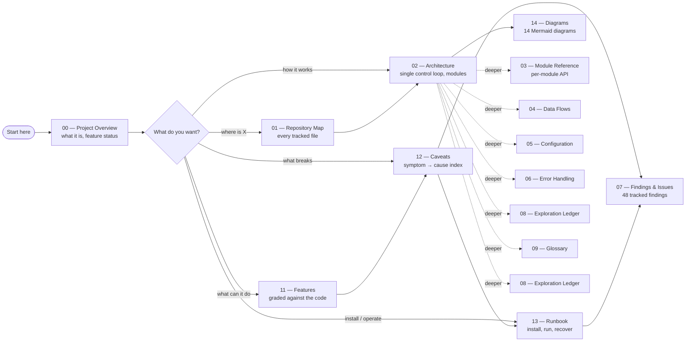

# Documentation

Project documentation for the Spotify Voice Assistant. Start at
**[00 — Project Overview](project-context/00_PROJECT_OVERVIEW.md)**.

Everything here is written against the source tree, not the marketing copy. Where the README and
the code disagree, the code is documented as the truth and the discrepancy is filed as a finding.

---

## Reading paths



---

## The docs

### Orientation

| Doc | Read it for |
|---|---|
| [00 — Project Overview](project-context/00_PROJECT_OVERVIEW.md) | Identity, the single control loop, feature status, limitations, next steps |
| [01 — Repository Map](project-context/01_REPOSITORY_MAP.md) | Every tracked file, what it does, who touches it |
| [10 — Context Index](project-context/10_CONTEXT_INDEX.md) | Which doc to open for which question |

### Reference

| Doc | Read it for |
|---|---|
| [02 — Architecture](project-context/02_ARCHITECTURE.md) | The control loop, lifecycle, dependency graph |
| [03 — Module Reference](project-context/03_MODULE_REFERENCE.md) | Per-module surface and the command dispatch table |
| [04 — Data Flows](project-context/04_DATA_FLOWS.md) | Step-by-step runtime traces |
| [05 — Configuration & Environment](project-context/05_CONFIGURATION_AND_ENV.md) | Env vars, `.env` location, optional backends |
| [14 — Architecture Diagrams](project-context/14_ARCHITECTURE_DIAGRAMS.md) | **14 Mermaid diagrams** — the visual index |

### Operation

| Doc | Read it for |
|---|---|
| [11 — Features & Capabilities](project-context/11_FEATURES_AND_CAPABILITIES.md) | Every feature graded ✅/⚠️/🐛/💀/👻 against the code |
| [12 — Caveats & Limitations](project-context/12_KNOWN_CAVEATS_AND_LIMITATIONS.md) | Symptom → cause index; what will surprise you |
| [13 — Runbook](project-context/13_RUNBOOK.md) | Install, run, troubleshoot, recover, uninstall |

### Process & history

| Doc | Read it for |
|---|---|
| [06 — Testing & Quality](project-context/06_TESTING_AND_QUALITY.md) | Recommended test priorities |
| [07 — Findings & Issues](project-context/07_FINDINGS_AND_ISSUES.md) | **48 findings** (D1–D56, 8 retracted) with `file:line` references |
| [08 — Exploration Ledger](project-context/08_EXPLORATION_LEDGER.md) | Coverage metrics, per-file ledger, known gaps |
| [09 — Glossary](project-context/09_GLOSSARY.md) | Term definitions and a "frequently confused" table |

---

## Conventions

- **Status icons** — ✅ works · ⚠️ partial · 🐛 broken · 💀 dead code · 👻 documented but missing ·
  🧪 unverified
- **Every claim is traceable.** Technical statements carry a `file:line` reference.
- **Findings are cited as `[Dnn](project-context/07_FINDINGS_AND_ISSUES.md)`.** D11, D14, D23,
  D32, D35, D37, D41 and D54 are **retracted** and carry no claim.
- **D1 is the delivery blocker**: `docs/` was git-ignored, so this documentation was not in a
  fresh clone. Fixed in `.gitignore`.
- **Diagrams are Mermaid** and are validated to parse.
- **Module docstrings** state the role and, where relevant, the `python -m …` invocation.

---

## Verification

The project has **no test suite, linter, formatter, or type checker**. These are the available
checks:

```bash
# 1. Syntax — the only build-level check that exists
python3 -m py_compile app/*.py

# 2. Documentation integrity
#    - every internal link resolves
#    - every [Dnn] citation resolves to a live finding
#    - every ```mermaid block parses
```

Do **not** run `python -m app.health_check` as a check: it writes to the filesystem, requires a
microphone, and cannot run at all when a package is missing. → [D2](project-context/07_FINDINGS_AND_ISSUES.md),
[D25](project-context/07_FINDINGS_AND_ISSUES.md)

---

## Ground rules for editing these docs

1. Do not modify application source to make a doc true. Fix the doc, or file the finding.
2. Do not "clean up" the dead code casually — some of it is reachable only through paths grep
   will not reveal. See the ledger in
   [08 — Exploration Ledger](project-context/08_EXPLORATION_LEDGER.md).
3. Preserve the permission bits: `cache/` = `0o700`, `.key` = `0o600`, `env/.env` = `0o600`.
4. Never stage `env/`, `cache/`, `logs/`, `calibration/`, or `app/__pycache__/`.
5. Treat `config/config.json` as sensitive: it is tracked and `save_config()` would write a
   secret into it. → [D19](project-context/07_FINDINGS_AND_ISSUES.md)

---

## Fast answers

| Question | Answer |
|---|---|
| How do I run it? | `python -m app.main` from the repo root |
| Where is my `.env`? | `env/.env` — **not** the repo root → [D4](project-context/07_FINDINGS_AND_ISSUES.md) |
| How do I type commands? | Press **Ctrl+C** once |
| How do I actually stop it? | Type `quit` in text mode |
| Why did `setup.sh` fail? | It copies a template that does not exist → [D3](project-context/07_FINDINGS_AND_ISSUES.md) |
| Why is there no sound? | Output is desktop notifications only → [D28](project-context/07_FINDINGS_AND_ISSUES.md) |
| Is it safe to commit everything? | Check `env/`, `cache/`, `logs/`, `calibration/`, `config/` first |