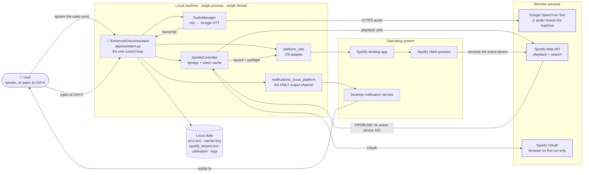

# 00 — Project Overview

## Identity

| Field | Value |
|---|---|
| Name | Enhanced Spotify Voice Assistant |
| Package | `app` (`__version__ = "1.0.0"`, `__author__ = "DevCrewX"`) |
| Repository | `https://github.com/ArindamTripathi619/spotify-voice-assistant` |
| License | MIT (c) 2025 ArindamTripathi619 |
| Shape | Single-process, single-threaded **local CLI daemon**. No web server, no database, no GUI toolkit. |
| Language | Python (developed against 3.7+; verified running on 3.14.3) |
| LOC | 2,627 lines of Python across 15 modules + 29 lines of JSON config |
| Last commit | `69a9724` — "🔒 Complete Security Audit Remediation - All 56 Issues Resolved" (16 commits total) |

## Problem Being Solved

Hands-free Spotify control on a desktop: the user speaks a wake word ("jarvis"), speaks a
command, and the assistant drives the Spotify Web API. Because it sleeps between commands
and reports through desktop notifications, it is designed to run in the background of a
tiling window manager (Hyprland/i3/Sway) without occupying a terminal.

It is a **client of two external services** and an **OS-integration client**:

1. **Spotify Web API** (via `spotipy`) — playback control, search, device selection.
2. **Google Speech-to-Text** (via `SpeechRecognition`'s `recognize_google`) — all voice input.
   Audio is streamed to Google; there is no offline mode.
3. **The local OS** — desktop notifications, and launching/spotlighting the Spotify desktop app.

### System context



Three properties of this diagram are the whole architecture:

- **There is no server.** Nothing listens on a port; the only inbound connection is Spotify's
  OAuth redirect, handled once during the browser handshake.
- **Recognition leaves the machine.** Every turn is an HTTPS round-trip to Google. There is no
  offline path, which is why wake detection is not instantaneous.
- **The notification arrow points one way.** Nothing is ever spoken; `speak()` has zero call
  sites. → [D28](07_FINDINGS_AND_ISSUES.md)

Full visual index: [14 — Architecture Diagrams](14_ARCHITECTURE_DIAGRAMS.md).

## Main Features (verified against code)

This is the summary table. The **graded, exhaustive** version — every capability with a
✅/⚠️/🐛/💀/👻 verdict, the full 9-rule routing table, and the reproduced routing bugs — is in
[11 — Features & Capabilities](11_FEATURES_AND_CAPABILITIES.md).

| Feature | Implementation | Works? |
|---|---|---|
| Wake-word gated listening | `AudioManager.listen_for_wake_word()` `app/audio.py:353` | Yes — substring match of wake word in recognized text |
| Song search + play | `SpotifyController.play_song()` `app/spotify_control.py:173` | Yes — but the router's rule 1 strips the substring `"track"` from any title, so titles containing that word cannot be searched → [D5](07_FINDINGS_AND_ISSUES.md) |
| Playback transport (play/pause/next/prev) | `app/spotify_control.py:230-346` | Yes |
| Volume ±15 | `SpotifyController.adjust_volume()` `app/spotify_control.py:349` | Yes, when the active device reports `volume_percent` |
| Auto-launch Spotify when no active device | `_launch_and_setup_device()` `app/spotify_control.py:411` | Yes (native + Flatpak on Linux) |
| Encrypted OAuth token cache | `SecureTokenStorage` `app/spotify_control.py:29` | Only if `cryptography` is installed (undeclared — see 07) |
| Rotating log file | `RotatingFileHandler` `app/assistant.py:14` | Yes — 1 MB × 5 |
| Interactive text mode + Ctrl+C toggle | `assistant.py:102-111, 162` | Yes |
| Changeable wake word (persisted) | `assistant.py:190` | Yes |
| "Now playing" query | `get_current_track()` `app/spotify_control.py:368` | **Broken** — see 07/D5 |
| Adaptive mic sensitivity from success rate | `adjust_sensitivity()` `app/audio.py:382` | **Dead** — see 07/D8 |
| Automatic fallback to text mode on recognition failure | — | **Does not exist** — see 07/D27 |
| Spoken (TTS) responses | `AudioManager.speak()` `app/audio.py:242` | **Never called** — see 07/D28 |
| Persistent audio-threshold calibration | `smart_calibration()` `app/audio.py:193` | **Ineffective** — see 07/D7 |
| `config/config.json` settings | `ConfigManager` `app/config.py:67` | **Orphaned** — see 07/D17 |

## Technology Stack

### Declared in `requirements.txt` (all version-pinned)

| Package | Version | Actually imported? | Role |
|---|---|---|---|
| `spotipy` | 2.22.1 | **Yes** (`app/spotify_control.py:1-2`) | Spotify Web API client |
| `SpeechRecognition` | 3.14.3 | **Yes** (`app/audio.py:1`) | Audio capture + Google STT |
| `pyttsx3` | 2.90 | **Yes** (constructed, never speaks) | TTS engine, effectively dead weight |
| `pyaudio` | 0.2.11 | transitively (via SpeechRecognition) | PortAudio bindings |
| `python-dotenv` | 1.0.0 | **Yes** (`app/utils.py:3`) | Loads `env/.env` |
| `colorama` | 0.4.6 | **No — zero references** | Unused |
| `psutil` | 5.9.8 | **No — zero references** | Unused |

### Imported but NOT declared

| Package | Where | Consequence |
|---|---|---|
| `cryptography` | `app/spotify_control.py:42` (`from cryptography.fernet import Fernet`) | `ImportError` is caught; tokens silently stored **unencrypted** with only a log warning |

### Optional, lazily imported, documented as optional

`plyer`, `win10toast` (`app/notifications_cross_platform.py:30,38,59,75`) — both correctly
guarded with `try/except ImportError`.

`requirements_cross_platform.txt` is a near-duplicate of `requirements.txt`; the
authoritative file is `requirements.txt` (all setup scripts install that one).

### System-level dependencies (not pip-installable)

- Linux: `portaudio19-dev`/`portaudio`, `espeak-ng`, `alsa-utils`, `pulseaudio`, `libnotify` (`notify-send`)
- Windows: Visual C++ Build Tools (PyAudio), microphone permission grant
- macOS: `brew install portaudio` (see SETUP.md:97) — **the automated macOS path is broken**, see 07/D21

## High-Level Architecture

A **flat, layered, single-process orchestrator**. There is exactly one long-running loop.

```
                    ┌───────────────────────────────┐
                    │  EnhancedVoiceAssistant       │  app/assistant.py
                    │  run(): the one control loop  │  THE ORCHESTRATOR
                    └───────┬───────────────┬───────┘
                            │               │
            ┌───────────────▼──┐         ┌──▼──────────────────┐
            │  AudioManager    │         │  SpotifyController  │
            │  app/audio.py    │         │  app/spotify_       │
            │  mic + Google    │         │  control.py         │
            │  STT + calib.    │         │  spotipy + tokens   │
            └────────┬─────────┘         └──┬──────────────────┘
                     │                      │
            ┌────────▼─────────┐   ┌────────▼──────────────────┐
            │ platform_utils   │   │ launch_spotify(_cross_    │
            │ (OS adapter)     │   │ platform)                 │
            └──────────────────┘   └───────────────────────────┘

  Cross-cutting:  utils (env)   ·   error_handling (mostly dead)   ·   config (orphaned)
  UX side-channel: notifications.py → notifications_cross_platform.py → win10toast | plyer | notify-send | osascript | stdout
```

Three files are thin **backward-compatibility shims** that exist only to preserve old import
paths: `app/notifications.py`, `app/launch_spotify.py`, and the `_cross_platform` naming
pattern. `app/config.py` is a fourth, fully orphaned module.

## Important Entry Points

| Command | Resolves to | Notes |
|---|---|---|
| `python -m app.main` | `app/main.py` → `EnhancedVoiceAssistant().run()` | **Primary documented path** |
| `python -m app` | `app/__main__.py` → `health_check.main()` | Health check, not the assistant |
| `python -m app.health_check` | `health_check.main()` | Documented in that module's docstring |
| `python -m app.config` | `create_default_config_file()` | Orphaned; writes `config/config.json` |
| `python app/main.py` | — | **Fails**: `main.py` uses a relative import |

## Development & Execution Commands

```bash
# Setup (Linux)
./setup                        # universal dispatcher -> universal_setup.sh
./universal_setup.sh           # interactive, multi-distro
./setup.sh                     # Arch-only, non-interactive

# Setup (Windows)
powershell -ExecutionPolicy Bypass -File setup_windows.ps1
setup_windows.bat

# Configure credentials  (see 05 — the documented path is WRONG in README/QUICKSTART)
mkdir -p env
printf 'SPOTIFY_CLIENT_ID=...\nSPOTIFY_CLIENT_SECRET=...\nSPOTIFY_REDIRECT_URI=http://127.0.0.1:8080/callback\n' > env/.env

# Install
python -m venv venv && source venv/bin/activate
pip install -r requirements.txt

# Run
python -m app.main

# Diagnose  (see 07/D2 — this crashes when deps are missing, which is its main use case)
python -m app.health_check
```

**There is no test command, no linter, no formatter, no type checker, and no CI.**
See `06_TESTING_AND_QUALITY.md`.

## Key Architectural Observations

1. **Single-threaded, blocking, and network-bound.** Every wake-word poll is a blocking
   `recognizer.listen(..., timeout=30)` followed by a blocking HTTPS call to Google. The
   assistant is idle-but-awake ~100% of its runtime, spending most of its wall clock in
   `time.sleep()` inside `_apply_google_api_rate_limit()` (`app/audio.py:308`).
2. **The only shared mutable state is the filesystem.** No database, no cache service, no
   queue. Four gitignored runtime directories hold everything: `logs/`, `calibration/`,
   `cache/`, `env/`.
3. **Secrets live in exactly one place** — `env/.env` — read through `os.getenv` at
   `app/assistant.py:39-41`. `config/config.json` has empty credential fields and is never read.
4. **Notifications are the entire user-facing output channel.** There is no GUI. When no
   notification backend is available, every message degrades to a `print()` to stdout.
5. **The command router is a flat substring chain** (`app/assistant.py:238-274`) with no
   tokenizer, no intent model, and no normalization beyond `.lower().strip()`. This is the
   single largest source of user-visible bugs (see 07/D5, D6).
6. **Roughly 40% of the codebase is not reachable from the running application** —
   `config.py` (287 lines) in full, plus ~75% of `error_handling.py`, plus several
   never-called methods. The README's "fully modularized" claim overstates the result.

## Known Limitations

- No offline/local speech recognition; requires internet + Google quota.
- `cryptography` is undeclared, so "encrypted tokens" is a coin flip on a clean install.
- `what's playing` does not work (routes to song search).
- `macOS` automated setup is non-functional; `README.md`'s `.env` instructions point to a
  path the code never reads.
- Wake word matching is a naive substring test — the wake word "go" or "a" would fire
  constantly; the calibration loader restricts wake words to `isalnum()` ≤ 50 chars, which
  does not prevent this.
- `config/`, `env/`, and `docs/` are all git-ignored in ways that surprise contributors
  (see 07/D1 and 07/D3).
