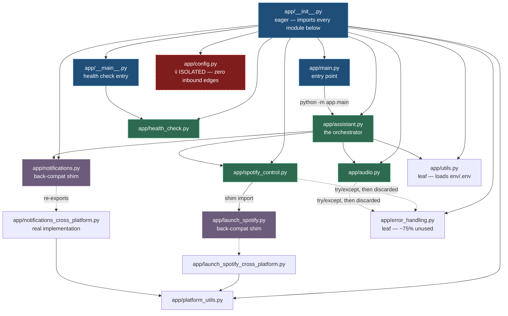

# 01 — Repository Map

Complete recursive inventory. **31 tracked files, 3 directories** (excluding `.git`).
There are no subdirectories other than `app/` and `config/`.

## Directory Tree

```
spotify-voice-assistant/
├── .gitignore                          # 105 lines — NOTE: ignores docs/ (see 07/D1)
├── LICENSE                             # MIT
├── Promotion.md                        # social-media copy, partially corrupted
├── QUICKSTART.md                       # fast-track guide (contains wrong .env path)
├── README.md                           # main documentation (partially stale/corrupted)
├── SETUP.md                            # per-platform setup reference
├── WINDOWS_PORT_GUIDE.md               # Windows port notes (295 lines)
├── windows_port_plan.md                # completed port plan, kept as a record
├── requirements.txt                    # AUTHORITATIVE dependency manifest
├── requirements_cross_platform.txt     # near-duplicate, unused by any script
├── setup                               # universal dispatcher (bash)
├── setup.sh                            # Arch-only non-interactive setup (bash)
├── universal_setup.sh                  # interactive multi-distro setup (bash)
├── setup_windows.ps1                   # Windows setup (PowerShell)
├── setup_windows.bat                   # Windows setup (cmd)
├── app/                                # the entire application
│   ├── __init__.py                     # package facade — EAGER IMPORTS (see 07/D2)
│   ├── __main__.py                     # `python -m app` -> health check
│   ├── main.py                         # `python -m app.main` -> the assistant
│   ├── assistant.py                    # ORCHESTRATOR + command router
│   ├── audio.py                        # mic, Google STT, calibration
│   ├── spotify_control.py              # spotipy client, token storage, rate limit
│   ├── notifications.py                # SHIM -> notifications_cross_platform
│   ├── notifications_cross_platform.py # win10toast | plyer | notify-send | osascript
│   ├── launch_spotify.py               # SHIM -> launch_spotify_cross_platform
│   ├── launch_spotify_cross_platform.py# native / flatpak / open -a
│   ├── platform_utils.py               # OS detection + paths + notification cmd
│   ├── error_handling.py               # ~75% DEAD (see 07/D18)
│   ├── health_check.py                 # standalone diagnostic CLI
│   └── config.py                       # FULLY ORPHANED (see 07/D17)
├── config/
│   └── config.json                     # ORPHANED — never read by the app
└── docs/                               # GIT-IGNORED (see 07/D1)
    └── project-context/                # this knowledge base
```

## Directory Responsibilities

| Directory | Tracked? | Purpose | Notes |
|---|---|---|---|
| `app/` | yes | All application code | Single Python package, no subpackages |
| `config/` | yes | JSON config for the orphaned `ConfigManager` | Never read at runtime |
| `docs/` | **NO — git-ignored** | This knowledge base | `.gitignore:13` |
| `logs/` | no | `voice_assistant.log` + 5 rotated backups | Created at import of `assistant.py:12` |
| `calibration/` | no | `.voice_calibration.json` | Created by `audio.py:97` |
| `cache/` | no | `.key`, `.spotify_tokens.enc` | Created by `spotify_control.py:34` |
| `env/` | no | `.env` credentials | **Read by the app** (`utils.py:6`) |
| `venv/` | no | virtualenv | created by setup scripts |

## File Inventory

Status key: **L1** = structural inspection, **L2** = full implementation read + traced,
**EXCL** = deliberately excluded (with reason).

### Application source (all L2)

| Path | Lines | Responsibility | Imports | Consumers | Status |
|---|---|---|---|---|---|
| `app/__init__.py` | 26 | Package facade; re-exports 8 symbols | assistant, audio, notifications, platform_utils, spotify_control, utils | any `import app` | L2 |
| `app/__main__.py` | 8 | `python -m app` → health check | health_check | CLI | L2 |
| `app/main.py` | 5 | `python -m app.main` → run the assistant | assistant | CLI, all docs | L2 |
| `app/assistant.py` | 274 | **Orchestrator**: main loop, signals, text mode, command router, log config | spotify_control, audio, notifications, utils, error_handling | `main.py`, `__init__` | L2 |
| `app/audio.py` | 387 | Mic selection, ambient calibration, Google STT, TTS (unused), wake-word match | speech_recognition, pyttsx3, error_handling (unused) | assistant | L2 |
| `app/spotify_control.py` | 485 | spotipy client, Fernet token cache, rate limiter, device discovery/launch | spotipy, launch_spotify, error_handling (unused) | assistant | L2 |
| `app/notifications_cross_platform.py` | 194 | Multi-backend desktop notification with fallback chain | platform_utils | notifications.py | L2 |
| `app/notifications.py` | 6 | Alias: `NotificationManager = CrossPlatformNotificationManager` | notifications_cross_platform | assistant, `__init__` | L2 |
| `app/launch_spotify_cross_platform.py` | 112 | Launch Spotify per-OS (native/flatpak/`open -a`) | platform_utils | launch_spotify.py | L2 |
| `app/launch_spotify.py` | 6 | Re-export shim for `launch_spotify`, `check_spotify_installation` | launch_spotify_cross_platform | spotify_control | L2 |
| `app/platform_utils.py` | 154 | `get_platform`, `is_windows/linux/mac`, Spotify path discovery, notification command | stdlib only | notifications_cross_platform, launch_spotify_cross_platform, health_check, `__init__` | L2 |
| `app/error_handling.py` | 308 | Error taxonomy (2 enums, 8 exception classes), `ErrorHandler`, `error_handler` decorator, `safe_call` | stdlib only | assistant (partially) | L2 |
| `app/health_check.py` | 369 | 8 environment/system checks + summary; exit 0/1/2 | platform_utils | `__main__.py`, CLI | L2 |
| `app/config.py` | 286 | `AudioConfig`/`SpotifyConfig`/`NotificationConfig`/`AssistantConfig` dataclasses + `ConfigManager` | stdlib only | **nobody** | L2 |
| `app/utils.py` | 7 | `load_environment()` → `load_dotenv(env/.env)` | python-dotenv | assistant, `__init__` | L2 |

### Configuration & data

| Path | Lines | Purpose | Status |
|---|---|---|---|
| `config/config.json` | 29 | Mirrors the `AssistantConfig` dataclass defaults. **Never read.** | L2 |

### Documentation

| Path | Lines | Purpose | Status |
|---|---|---|---|
| `README.md` | 370 | Main doc. Contains a corrupted Roadmap block (lines 292-295), mojibake at line 305, a stale project tree, and a wrong `.env` path at line 115. | L2 |
| `SETUP.md` | 215 | Per-platform setup. Correct `env/.env` path (line 110) but references a non-existent template; claims macOS/Homebrew support that does not work (line 82). | L2 |
| `QUICKSTART.md` | 190 | Fast-track guide. Wrong `.env` path (line 51). Repeats the false "auto-fallback to text mode" claim (lines 110, 134). | L2 |
| `WINDOWS_PORT_GUIDE.md` | 295 | Windows port reference. Largely accurate; line 83 references the missing template. | L1 (structure + targeted claims verified) |
| `windows_port_plan.md` | 40 | Historical port plan, all items marked ✅ complete. Retained as a record. | L2 |
| `Promotion.md` | 48 | Social media copy. Two posts merged with a corrupted seam at line 28. | L2 |
| `LICENSE` | 20 | MIT | L2 |

### Build / setup / infrastructure

| Path | Lines | Purpose | Status |
|---|---|---|---|
| `setup` | 83 | Dispatcher: `uname` → `universal_setup.sh` / `setup_windows.ps1`. References a non-existent `setup_macos.sh` (line 51). | L2 |
| `setup.sh` | 113 | Arch-only (`pacman` required). **Aborts at line 63** on a clean clone. | L2 |
| `universal_setup.sh` | 165 | Interactive multi-distro. **Aborts at line 115** on a clean clone. | L2 |
| `setup_windows.ps1` | 212 | Windows setup. **Correctly** handles the missing template by generating `.env` inline (lines 163-180). Supports `-SkipDependencies`, `-SkipSpotifyCheck`, `-NoVenv`. | L2 |
| `setup_windows.bat` | 188 | cmd equivalent. Same correct inline-`.env` fallback (lines 125-143). | L2 |
| `requirements.txt` | 24 | Authoritative manifest | L2 |
| `requirements_cross_platform.txt` | 44 | Duplicate; no script consumes it | L2 |
| `.gitignore` | 105 | Ignores `docs/`, `logs/`, `calibration/`, `env/`, `cache/`, `venv/`, `*.log`, `*.wav` | L2 |

### Explicitly excluded

| Item | Reason |
|---|---|
| `.git/` internals | VCS metadata, not project content |
| `venv/`, `logs/`, `calibration/`, `cache/`, `env/` | Do not exist in a clean clone; all git-ignored; generated at runtime. Their creators and contents are documented above. |
| Third-party package internals (spotipy, SpeechRecognition, pyttsx3) | Not first-party. Interfaces used are documented in `03_MODULE_REFERENCE.md`. `spotipy`'s `cache_handler` duck-typing contract is the only external behaviour the project depends on. |

## Module Boundaries and Import Direction

```
                    ┌──────────────┐
                    │  app/__init__ │  (eager — imports all of the below)
                    └──────┬───────┘
              ┌────────────┼─────────────┬──────────────┐
              ▼            ▼             ▼              ▼
        assistant      __main__    notifications    platform_utils
        /    \            │            │              ▲   ▲   ▲
       ▼      ▼           ▼            ▼              │   │   │
     audio  spotify_   health_    notifications_      │   │   │
       │    control      check     cross_platform ───┘   │   │
       │       │           │                            │   │
       │       ▼           │                            │   │
       │  launch_spotify ──┴────────────────────────────┘   │
       ▼            │                                       │
  error_handling   ▼                                       │
  (leaf)     launch_spotify_cross_platform ────────────────┘

  utils            (leaf, imported by assistant)
  config           (ISOLATED — no inbound edges)
```

**Verified by AST walk:** `app/config.py` is the *only* module with zero inbound imports.
Every other module is reachable from an entry point. 21 intra-package import edges, **no cycles**.

### Same graph, in Mermaid



Three structural facts, each with a consequence:

| Fact | Consequence |
|---|---|
| `__init__.py` imports everything | one missing third-party package breaks `python -m app.health_check` → [D2](07_FINDINGS_AND_ISSUES.md) |
| Two shims sit between callers and the real code | `NotificationManager` takes **two hops** to resolve; renaming the real module silently breaks callers |
| `config.py` has no inbound edge | 286 LOC of unreachable config, and `save_config()` would write a secret into a **tracked** file → [D17](07_FINDINGS_AND_ISSUES.md), [D19](07_FINDINGS_AND_ISSUES.md) |

The dotted `error_handling` edges are `try/except ImportError` blocks whose result is immediately
assigned to `None` — the import is never used.

## Important File Relationships

- `app/assistant.py:6` imports `NotificationManager` from the **shim** `notifications.py`, which
  re-exports from `notifications_cross_platform.py`. Two hops to reach the real class.
- `app/spotify_control.py:10` imports `launch_spotify` from the **shim** `launch_spotify.py`.
- `app/audio.py:9` and `app/spotify_control.py:14` both wrap `from .error_handling import
  ErrorHandler` in `try/except ImportError` and then set `self.error_handler = None` with the
  comment "Will be assigned by VoiceAssistant" — **it never is.** Both imports are pointless.
- `app/assistant.py:31-44` builds the four runtime paths by string concatenation
  (`os.path.join(os.path.dirname(__file__), '../logs')`), *not* via `config.py`'s
  `get_absolute_path()`. This is why `config.py` is orphaned.
