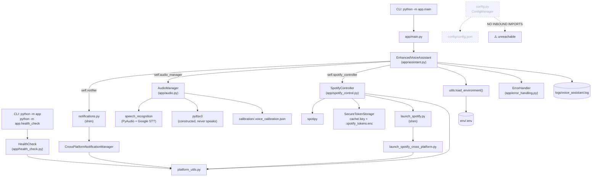
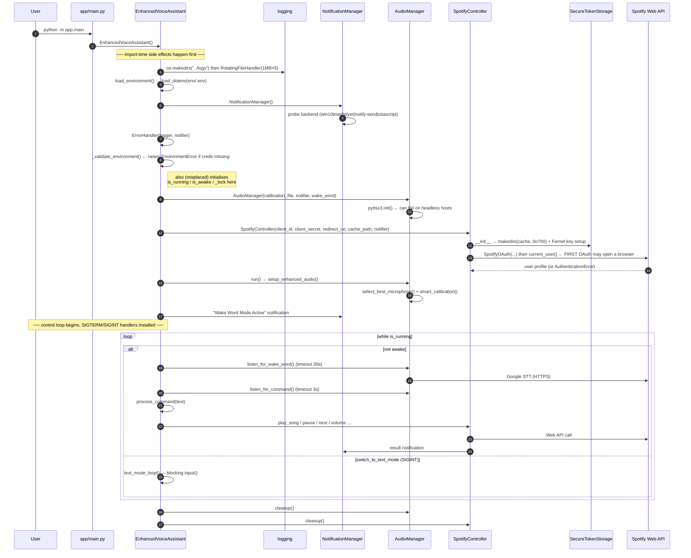

# 02 — Architecture

## Architectural Style

A **layered monolith with a single orchestrator**, deployed as a foreground process on the
user's desktop. There is no service boundary, no message bus, no persistence layer, and no
network listener. The only concurrency primitive in the codebase is `threading.Lock`, used
defensively in two places, plus one daemon thread for (unused) TTS.

Characteristics worth internalising before changing anything:

- **Dependency direction is strictly downward.** `assistant` → {audio, spotify_control,
  notifications, utils}. `audio`/`spotify_control` → {platform_utils, launch_spotify,
  error_handling}. Nothing imports `assistant` except `main.py`/`__init__.py`.
- **The orchestrator owns all control flow.** No module raises through to a caller expecting
  recovery; every public method of `AudioManager` and `SpotifyController` swallows its own
  exceptions and communicates failure via a desktop notification or a `None` return.
- **The OS is abstracted by exactly two functions** in `platform_utils.py`:
  `is_windows()/is_linux()/is_mac()` and `get_spotify_executable_path()`. Every OS-specific
  branch in the codebase keys off those.

## Component Relationships

## Dependency Direction Summary

| Module | Depends on | Depended on by |
|---|---|---|
| `assistant.py` | audio, spotify_control, notifications, utils, error_handling | `main.py`, `__init__.py` |
| `audio.py` | error_handling *(import unused)* | `assistant.py`, `__init__.py` |
| `spotify_control.py` | launch_spotify, error_handling *(import unused)* | `assistant.py`, `__init__.py` |
| `notifications_cross_platform.py` | platform_utils | `notifications.py` |
| `launch_spotify_cross_platform.py` | platform_utils | `launch_spotify.py` |
| `platform_utils.py` | stdlib only | notifications_cross_platform, launch_spotify_cross_platform, health_check, `__init__.py` |
| `error_handling.py` | stdlib only | assistant *(partially)* |
| `utils.py` | python-dotenv | assistant, `__init__.py` |
| `health_check.py` | platform_utils | `__main__.py` |
| `config.py` | stdlib only | **nobody** |

**No circular dependencies exist.** Verified by AST walk of all 15 modules.

## Major Design Patterns Present

| Pattern | Where | Verdict |
|---|---|---|
| **Facade / re-export** | `__init__.py` (8 symbols), `notifications.py`, `launch_spotify.py` | Real, but the shims add indirection with no value; `__init__.py`'s version is actively harmful (07/D2) |
| **Adapter (OS-specific)** | `platform_utils.py`, `notifications_cross_platform._setup_*`, `launch_spotify_cross_platform._launch_*` | The healthiest pattern in the codebase. Platform branches are localised and total (each returns a value for every OS) |
| **Strategy + fallback chain** | `CrossPlatformNotificationManager` backends | Structure is right; the chain is **broken** — the first backend always reports success (07/D9) |
| **Decorator (cross-cutting)** | `SpotifyRateLimiter` (07/D10), `error_handler` (07/D18) | Both partially broken |
| **Strategy (secret storage)** | `SecureTokenStorage` satisfies spotipy's `cache_handler` protocol | Real duck-typed integration; undeclared optional dependency (07/D16) |
| **Repository / data-access** | — | **None.** spotipy *is* the data-access layer |
| **MVC / layered web** | — | **None** — not a web app |
| **Event-driven / pub-sub** | — | **None** — direct method calls only |
| **Dependency injection** | `AudioManager(calibration_file=, notifier=, wake_word=)`, `SpotifyController(client_id=, …, notifier=)` | Real constructor injection. But `self.error_handler` is *not* injected despite comments claiming it will be |
| **Builder / fluent** | `SpotifyOAuth(cache_handler=…)` | spotipy's own |
| **Registry (grader)** | `ErrorHandler._standardize_error` substring chain | Real, and order-dependent (first match wins → misclassification, see 07) |

## Application Lifecycle

### Startup, in exact order (verified by reading `app/assistant.py:21-90`)

1. **Import time** (before any object exists): `assistant.py:11-17` creates `logs/`, attaches a
   `RotatingFileHandler`, and calls `logging.basicConfig`.
2. `load_environment()` — `load_dotenv(<repo>/env/.env)`.
3. `NotificationManager()` — probes and fixes a notification backend.
4. `ErrorHandler(...)`.
5. `_validate_environment()` — raises `EnvironmentError` if `SPOTIFY_CLIENT_ID` or
   `SPOTIFY_CLIENT_SECRET` is missing/blank. **Note:** lines 82-90 (initialising `is_running`,
   `is_awake`, `switch_to_text_mode`, `_lock`) are *misplaced inside this validation method* —
   they run only on the success path. This is a code-organisation defect, not a functional one.
6. `AudioManager(...)` — constructs a `sr.Recognizer()` and calls `pyttsx3.init()`.
7. `SpotifyController(...)` — creates the token store, then immediately calls
   `self.spotify.current_user()`. **On a first run this triggers the interactive Spotify OAuth
   browser flow during construction**, so `EnhancedVoiceAssistant()` can block on user input
   before `run()` is ever called.

### Steady state

One iteration of the loop at `app/assistant.py:113-142`:

- If `switch_to_text_mode` → run the blocking text REPL, then re-announce and `continue`.
- Else if not awake → `listen_for_wake_word()`. On a hit, announce, then
  `listen_for_command()` → `process_command()` → `is_awake = False`.
- Else (the `else` at line 141-142) → immediately `is_awake = False`. **This branch is
  unreachable in practice**, because every path that sets `is_awake = True` also clears it
  before the next iteration.

### Shutdown

`SIGTERM` → `is_running = False`. `SIGINT` (Ctrl+C) → text mode, *not* shutdown; quitting from
text mode requires typing `quit`/`exit`/`q` or speaking a quit command.

Cleanup runs in `finally` (`assistant.py:149`). Note `_cleanup_resources()` is **also** called
in the `except` branch at line 146, so on a fatal error it runs **twice**. It is idempotent
(guarded by `hasattr`), so this is harmless — but it is unintentional.

### Error recovery

There is no retry-with-backoff, no circuit breaker, and no supervisor. The single recovery
mechanism is the `try/except` in `run()` which logs, notifies, cleans up, and **re-raises** —
terminating the process. Every other failure is absorbed at the method boundary and turned
into a notification.

## Dependency Direction Violations and Architectural Debt

1. **`app/__init__.py` imports the whole application eagerly.** Any `python -m app.<anything>`
   executes it, so *every* module requires `spotipy` + `speech_recognition` + `pyttsx3` to be
   importable — including `health_check`, whose entire purpose is diagnosing missing
   dependencies. See 07/D2 for the reproduced traceback.
2. **Configuration bypasses the configuration module.** `assistant.py` hardcodes
   `os.path.join(os.path.dirname(__file__), '../logs')` etc. in four places while
   `config.py` sits unused with a `get_absolute_path()` helper built for exactly this.
3. **A half-wired error-handling layer.** Two modules declare `self.error_handler = None  # Will
   be assigned by VoiceAssistant`. `VoiceAssistant` was renamed to `EnhancedVoiceAssistant`
   during a refactor and the wiring was never completed. The result is ~230 dead lines.
4. **Two "compatibility" shims with no historical consumers left to protect** — the codebase
   is 16 commits old; `git log` shows the `_cross_platform` split happened in the same
   session as the shims' creation (`0fd152a`).
5. **No vertical separation between "capture audio" and "interpret audio".** `AudioManager`
   mixes hardware selection, calibration persistence, network STT, TTS, and sensitivity policy
   in one 387-line class.
