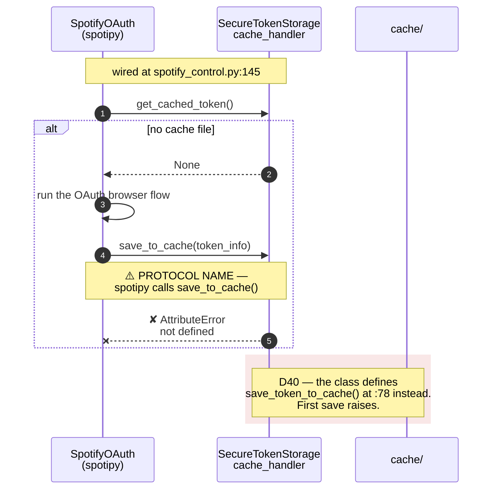
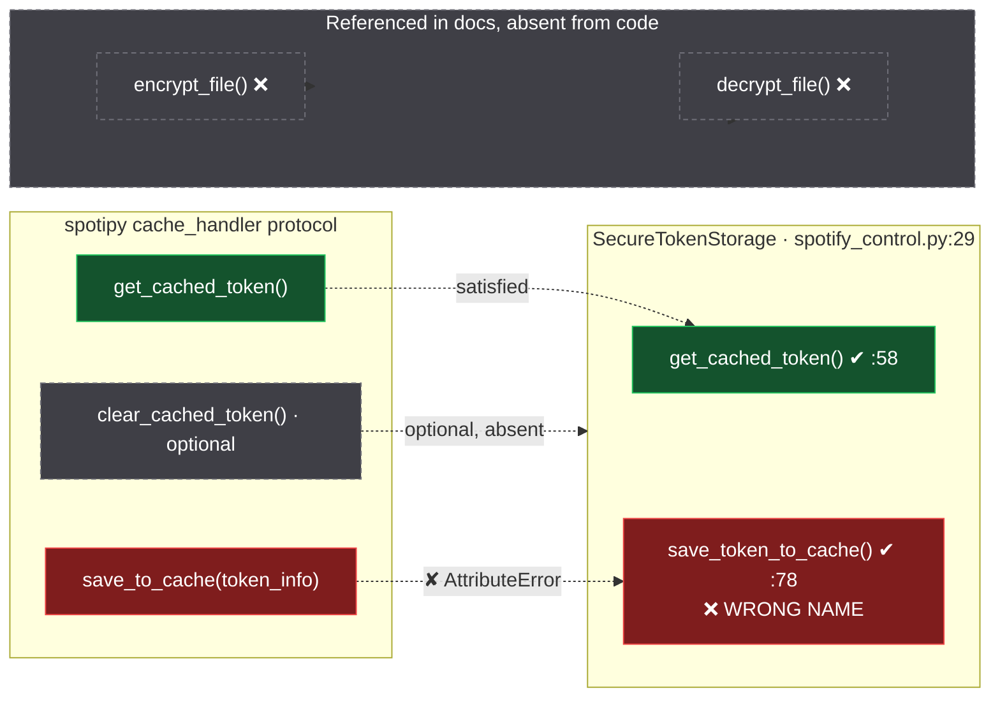

# 04 — Data Flows

Every runtime path, traced end to end. Paths that do not exist are called out explicitly —
several were claimed in the first draft of this document and are retracted here.

---

## 1. Cold start: `python -m app.main`

```
app/main.py:2          from app.assistant import EnhancedVoiceAssistant
                       └─ triggers app/__init__.py  → imports 8 modules  [D2: hard-fails here
                          app.assistant, app.audio, app.notifications,        if deps missing]
                          app.platform_utils, app.spotify_control, app.utils
app/assistant.py:11-17 IMPORT-TIME SIDE EFFECT
                       ├─ os.makedirs("<repo>/logs")            ← creates a dir on any import
                       └─ RotatingFileHandler(voice_assistant.log, 1 MiB, 5 backups)
app/assistant.py:23    NotificationManager()                   → setup_notifications() [:10]
app/assistant.py:26    ErrorHandler(self.notifier)              → constructed, used once at :274
app/assistant.py:31-33 env, cache, logs, calibration paths derived from __file__
app/assistant.py:35    AudioManager()
                       ├─ audio.py:15  sr.Recognizer()
                       ├─ audio.py:16  pyttsx3.init()  ← UNGUARDED  [D22]
                       └─ audio.py:45  setup_enhanced_audio() → 8 attrs on self.recognizer  [D7: never used]
app/assistant.py:43    SpotifyController(...)
                       ├─ spotify_control.py:133  self.error_handler = None  (never reassigned) [D36]
                       ├─ :136  cache_dir = os.path.dirname(cache_path)
                       ├─ :137  SecureTokenStorage(cache_dir) → _setup_encryption() [:39]
                       └─ :145  SpotifyOAuth(..., cache_handler=self.secure_token_storage)
                                └─ spotipy expects .save_to_cache(); only
                                   .save_token_to_cache() [:78] exists            [D40 — CRITICAL]
app/assistant.py:48    _validate_environment()
                       ├─ checks SPOTIFY_CLIENT_ID / _SECRET / _REDIRECT_URI
                       ├─ raises EnvironmentError if missing (notified :72-73)
                       └─ :82-84 MISPLACED state init: is_running / is_awake /
                                  switch_to_text_mode live here, so they exist only on
                                  the success path
app/assistant.py:95    notify "🎉 Enhanced Spotify Assistant Started"
app/assistant.py:102-111 install SIGTERM (is_running=False) and SIGINT (switch_to_text_mode=True)
app/assistant.py:113   while self.is_running  ──► the control loop
```

**Env resolution:** only `env/.env` is ever read, via `app/utils.py:5`
(`os.path.join(dirname(__file__), "../env/.env")` → `load_dotenv`). `load_dotenv` does **not**
override real environment variables, so shell vars win. `config/config.json` is never read [D17].

---

## 2. The control loop (`assistant.py:113-142`)

This is a **two-phase gated cycle**, not a linear wait-then-act loop. `listen_for_wake_word`
returns a **bool**, not a transcript:

```
113  while self.is_running:
114      if self.switch_to_text_mode:
115          self.switch_to_text_mode = False        ← self-clearing (D52)
116          text_mode_loop()                        [:162]  blocking input() REPL
117-123      notify("😴 Wake Word Mode Active", "Say '{wake_word}' …")
124          continue
125      if not self.is_awake:
126          if listen_for_wake_word():              audio.py:353 → bool
127              self.is_awake = True
128-134          notify("👂 Assistant Awakened")
135              command = listen_for_command()      audio.py:258 → str | None
136              if command:
137                  process_command(command)        assistant.py:238
138                  self.is_awake = False
139              else:
140                  self.is_awake = False
141      else:
142          self.is_awake = False                   ← effectively unreachable
143  except Exception as e:
144      logging.exception(...)
145      notify("💥 Assistant Error")
146      _cleanup_resources()
147      raise
148  finally:
149      _cleanup_resources()                        ← runs even on the raise path
```

`listen_for_command` returns the lowercased transcript or `None`. `None` is the only
"not heard" signal — there is no distinction between silence, an unrecognised phrase, and
a Google API error, because `_try_speech_recognition` (`audio.py:322`) returns `None` for all
three. **Consequence:** a network failure to Google is indistinguishable from silence, and the
loop silently retries forever. See §6.

---

## 3. Voice capture: `listen_for_wake_word` (`audio.py:353`)

Returns **`bool`**, not a transcript. It calls `recognize_google` **directly** — it does not go
through `_try_speech_recognition`, and it has no rate limiter.

```
353  def listen_for_wake_word(self) -> bool:
356      recognizer = sr.Recognizer()        ← LOCAL; discards self.recognizer  [D7]
357      mic = self.select_best_microphone() ← SHARED, lock-guarded, never closed  [D55]
358      with mic as source:
359          recognizer.adjust_for_ambient_noise(source, duration=0.2)   ← ACTIVE (0.2 s only)
366      recognized_text = recognizer.recognize_google(audio, language='en-US').lower()
368      if self.wake_word.lower() in recognized_text:  return True     ← SUBSTRING match
371      else:                                          return False
372-377  UnknownValueError / RequestError / WaitTimeoutError → False    ← all failures = False
```

Two consequences beyond the missing rate limit:
- `'en-US'` is pinned here, but `listen_for_command`'s `_try_speech_recognition` passes **no**
  `language` — the two paths do not agree on language handling.
- The wake word is matched as a **bare substring** of the whole utterance (`:368`), so any
  sentence containing the wake word triggers the command phase.
- A Google outage is indistinguishable from "wake word not spoken": both yield `False`, and the
  loop immediately polls again with no backoff. So wake-word polling can exceed the 45/min
  Google ceiling [D47].

## 4. Voice capture: `listen_for_command` (`audio.py:258`)

```
258  def listen_for_command(self, timeout=3):
261      self.is_awake = True
265      self.notifier.send_notification("🎤 Listening...", ...)
264-278  @contextmanager audio_resources():  creates a LOCAL sr.Recognizer(),
         yields (recognizer, mic); `finally` only rebinds locals to None — it does NOT
         close the stream (the mic is shared & cached, so nothing to close)
280      with audio_resources() as (recognizer, mic):
283          self._apply_google_api_rate_limit()              ← the ONLY call site  [D47]
286          recognizer.adjust_for_ambient_noise(source, duration=0.2)
287-291      audio = recognizer.listen(source, timeout=timeout, phrase_time_limit=7)
294          command = self._try_speech_recognition(recognizer, audio)   ← takes BOTH args
299          self.adjust_sensitivity()                  ← permanent no-op [D8]
302-304  WaitTimeoutError → None
```

`is_awake` (assistant's flag) is set here at `:261` and read **nowhere** — assistant reads its
own `self.is_awake`, not the audio manager's. The two are independent attributes with the same
name.

## 5. Shared Google STT (`audio.py:322`)

```
322  def _try_speech_recognition(self, recognizer, audio) -> Optional[str]:
       recognizer.recognize_google(audio)         ← unconfigured; uses Google's defaults
       except sr.UnknownValueError      → None
       except sr.RequestError          → None      ← network error is indistinguishable from silence
       generic except                   → None
```

`recognize_google` is called with **no** `language`, `show_all`, or `max_results` argument, so
Google's automatic language detection governs a project that only ever claims English support.
Every failure mode collapses to `None` [see §2 consequence].

## 6. Google rate limiter (`audio.py:308`) — correct, but one call site

```
308  def _apply_google_api_rate_limit(self):
310      if not hasattr(self, '_last_api_call'):
311          self._last_api_call = 0
312          self._api_call_interval = 60.0 / 45        # 45/min
       time_since_last = time.time() - self._last_api_call
       if time_since_last < self._api_call_interval:
           time.sleep(self._api_call_interval - time_since_last)
       self._last_api_call = time.time()
```

This is a correct fixed-interval limiter with an inline `sleep`. The defect is not in the
algorithm — it is that `listen_for_wake_word` never calls it [D47].

---

## 7. Command dispatch — the verified table (`assistant.py:238-274`)

All rules are **substring** tests on the lowercased, stripped input; **first match wins**. There
is **no `else` branch** — an unmatched command is a **silent no-op**. Executed results come from a
recording fake, not a mock assertion.

| # | Line | Test | Target | Verified result |
|---|---|---|---|---|
| 1 | `:242` | `'play' in c and len(c.split()) > 1` | `play_song(...)` after removing `the song`/`song called`/`track` (`:243-246`); **returns early** if non-empty | `"play bohemian rhapsody"` → `play_song('bohemian rhapsody')` ✔ · **`"what is playing"` → `play_song('ing')` ✘ [D5]** |
| 2 | `:250` | any of `play,start,resume,go` | `resume_playback()` | **`"goodbye"` → `resume_playback()` ✘ [D6]** · **`"go back to previous track"` → `resume_playback()` ✘ [D6]** |
| 3 | `:252` | any of `pause,stop,halt` | `pause_playback()` | `"stop"`/`"pause"`/`"halt"` ✔ · **`"stop doing that"` → `pause_playback()` ✘ (bare `'stop'` substring)** |
| 4 | `:254` | any of `next,skip,forward` | `next_track()` | ✔ |
| 5 | `:256` | any of `previous,back,last` | `previous_track()` | ✔ · reachable **only** because `"go back…"` is eaten by rule 2 |
| 6 | `:258` | `volume up` \| `louder` \| `turn up` (contiguous) | `adjust_volume(+15)` | `"volume up"` ✔ `"louder"` ✔ · **`"turn it up"` → SILENT NO-OP ✘** |
| 7 | `:260` | `volume down` \| `quieter` \| `turn down` (contiguous) | `adjust_volume(-15)` | `"volume down"` ✔ `"quieter"` ✔ · **`"turn it down"` → SILENT NO-OP ✘** |
| 8 | `:262` | any of `what,playing,current,now` | `get_current_track()` | **`"what is this"`/`"now"`/`"what song"` → `get_current_track()` ✔** — reachable, contrary to the first pass. Only the *documented* phrasings `"what's playing"`/`"now playing"` are lost to rule 1 [D5] |
| 9 | `:264` | any of `quit,exit,bye,goodbye` | notify + `is_running = False` | `quit` ✔ `exit` ✔ `bye` ✔ **`goodbye` ✘ [D6]** |
| — | `:273-274` | **none** | — | unmatched input → **silent no-op**; only an *exception* produces a notification via `self.error_handler.handle_error` |

**Word-extraction quality:** rule 1 removes the filler phrases `the song` / `song called` /
`track`, but nothing strips a leading article or a `by <artist>` tail, so
`"play a song by drake"` → `play_song('a song by drake')`. spotipy's `search(q=...)` is tolerant
of that, so it mostly works — but this is a substring slice, not extraction.

**⚠️ Retracted:** the first draft of this document claimed a *pre-flight device check on every
command* with repeated OAuth. **False** — see §8. There is no such flow.

---

## 8. `play_song` — the real device flow (`spotify_control.py:173`)

Exception-driven, not pre-flight. The first draft's "OAuth storm" narrative is retracted.

```
173  play_song(song_name):
174      results = spotify.search(q=song_name, type='track', limit=3)   [@RateLimiter(6/s)]
175      if results['tracks']['items']:
177          track = items[0]                       ← first result, no ranking/selection
179          try: spotify.start_playback(uris=[track['uri']])
                   └── NO device_id supplied; Spotify resolves it server-side
180          except spotipy.SpotifyException as e:
181              if 'No active device' in str(e):    ← STRING MATCH on the message
182                  device_id = _handle_no_active_device("song playback")
                          └─ _handle_no_active_device  [:453]  → notify "❌ Spotify Not Running"
                                                                 → _launch_and_setup_device() [:411]
                                                                 → _find_active_device()   [:403]
                                                                 → launch_spotify()        [412]
                                                                 → poll 10× @ 0.3 s  [425-429]
                                                                 → transfer_playback(force_play=True)
                                                                 → sleep 0.5 → return device_id
185                  if device_id:                  ← correctly guarded against None
186                      start_playback(uris=[...], device_id=device_id)
                              except → notify "❌ Playback Error" → return
                      (no device_id) → return silently
              else:  → notify "❌ Playback Error"
      else: no results → notify "❓ Song not found"
```

**Properties of this flow, as written:**

- One `search` + one `start_playback` in the happy path. **No repeated OAuth.**
- Device recovery is triggered by an *exception string match*, not a status check.
- `_find_active_device` (`:403`) returns the first device with `is_active` **or**
  `type == 'Computer'`, so it can hand back an **idle** computer, which is then
  `transfer_playback(force_play=True)`d — silently hijacking playback [D48].
- The poll loop calls the undecorated `self.spotify.devices()` **10× in 3 s** [D48].
- Only `items[0]` is ever played. `limit=3` is fetched and 2 results discarded.

**Retracted:** `play_music`, `play_song_by_artist`, `check_spotify_status`,
`_rate_limited_call`, `get_active_device`, `activate_spotify`, `search_spotify_track` — **none of
these exist** (0 `def` matches each).

---

## 9. Other controller operations

| Op | Line | Flow | Guarded? |
|---|---|---|---|
| `resume_playback` | `:230` | `start_playback()` | no device fallback |
| `pause_playback` | `:271` | `pause_playback()` | no device fallback |
| `next_track` | `:287` | `current()` → `current['item']` (`:293`) → `next_track(track['uri'])` | ✘ **`item` may be `None` [D12]** |
| `previous_track` | `:318` | `current()` → `current['item']` (`:324`) → `previous_track(...)` | ✘ same [D12] |
| `adjust_volume(change)` | `:349` | `current['device']['volume_percent']` (`:352`) → `+change` → clamp `0..100` (`:353`) → `spotify.volume(abs)` | device-scoped; **no `else` branch → silent no-op [D46]**; catches `'Cannot control device volume'` |
| `get_current_track` | `:368` | `current()` → `current['item']` (`:372`) → notify | ✘ `item` may be `None` [D12] · **is called** via rule 8 |

`adjust_volume` calls `self.spotify.volume(<absolute value>)` — **not** `volume_up` /
`volume_down`.

**Rate limiting:** each of `play_song`, `resume_playback`, `pause_playback`, `next_track`,
`previous_track`, `adjust_volume`, `get_current_track` carries
`@SpotifyRateLimiter(calls_per_second=6)` (`:172, 229, 270, 286, 317, 348, 367`). Because each
decorator expression is a **separate instance evaluated at class-definition time**, there is no
aggregate limit [D10]. `self.rate_limiter = SpotifyRateLimiter(calls_per_second=8)` at `:149`
is dead.

**429 path:** `except Exception as e:` (`:118`) → `retry_after = int(e.headers.get('Retry-After', 60))`
(`:120`) → `time.sleep(retry_after)` → retry. `e.headers` may be absent or non-dict [D13].

---

## 10. Token persistence — the broken contract

```
spotipy SpotifyOAuth  ──requires──▶  cache_handler.save_to_cache(token_info)
                                              │
   SecureTokenStorage ──defines───────────────┼──✘ MISSING
     get_cached_token    :58  ✔
     save_token_to_cache :78  ✘ wrong name
     clear_cached_token  —    ✘ absent (optional)
     encrypt_file / decrypt_file — ✘ DO NOT EXIST (first draft claimed they did)

→  self.spotify_oauth = SpotifyOAuth(..., cache_handler=self.secure_token_storage)  :145
```

The first successful token save raises `AttributeError`. **The single most severe finding in the
project, and it was missed by reading `SecureTokenStorage` in isolation** — it surfaced only by
comparing the class against spotipy's published `cache_handler` protocol. [D40]

Because the cache handler is effectively never called, D16 (undeclared `cryptography` →
plaintext fallback) and D15 (key stored beside ciphertext) are **real but secondary** — the
plaintext path is unreachable in the user flow.

### 10a. Token persistence as a sequence diagram



### 10b. What the class actually implements



---

## 11. Notification fan-out (`notifications_cross_platform.py`)

```
92   send_notification(title, message, icon, urgency, timeout)     ← TITLE FIRST
       ├─ if not notifications_enabled → print(...) and RETURN     :94-97
       ├─ backends_to_try = [primary]                                :99
       ├─ + 'plyer' if available and primary != 'plyer'             :100-102
       └─ for backend: _try_send_with_backend(...) → return on first True   :104-111
114  print(f"NOTIFICATION: {title} - {message}")                    ← console fallback

116  _try_send_with_backend → dispatches, returns False for unknown backend (:127), else True (:128)
130  _send_windows_toast      → try/except, swallows everything, logging.warning only  :141
144  _send_plyer_notification → try/except, swallows everything                        :153
156  _send_linux_notification → try/except, swallows everything                        :171
174  _send_mac_notification   → SANITISES then array-form subprocess.run              :176-194
```

**The fallback chain is well built and cannot fire** [D9]. All four send methods swallow their
own exceptions, so `_try_send_with_backend` always returns `True` and the loop exits on the
first iteration. The `print()` at `:114` is only reachable via `notifications_enabled = False`.

**This is the best-hardened module in the project.** `_send_mac_notification` (`:174-194`)
length-limits to 100/300 chars, escapes `"` → `\"`, replaces newlines with spaces, and uses
**array-form** `subprocess.run(['osascript', '-e', script], timeout=5)` — no `shell=True`, no
`which`. The first draft's D9 ("AppleScript injection") and D35 ("shells out via `which`) are
**retracted as false**.

Argument order is `(title, message, ...)` and every call site agrees — including
`assistant.py:23`. (`import shlex` at `:177` is unused [D49].)

---

## 12. Shutdown

```
SIGTERM  → handle_sigterm [:102] → is_running = False      (no notification)
SIGINT   → handle_sigint  [:106] → switch_to_text_mode = True + notify  (:109-110)
loop exit → _cleanup_resources [:151]
             hasattr-guarded, idempotent
             :152-154 audio.cleanup() → recognizer + mic source teardown
             :156-157 spotify.cleanup()  → see below
         finally: :159 spotify.cleanup()

474  SpotifyController.cleanup():
478     if hasattr(self.spotify_oauth, 'cache_path'):        ← True; spotipy has the attribute
479         if os.path.exists(self.spotify_oauth.cache_path): ← value is None → TypeError
480             os.remove(...)
481     except Exception as e: if self.error_handler:         ← ALWAYS None (:133) → swallowed
```

**`cleanup()` cannot clear the token cache, ever** [D36]. `self.error_handler = None` is set at
`:133` with the comment `# Will be assigned by VoiceAssistant` and never assigned — the class was
renamed to `EnhancedVoiceAssistant` and the wiring was never finished, so the `except` at
`:480-482` discards any failure silently.

The no-op holds under all three possible states of `spotify_oauth.cache_path`, so it does not
depend on resolving the spotipy version: `None` → `TypeError` → swallowed; the default
`".cache"` → does not exist (the project uses `cache/`) → condition false; attribute absent →
`hasattr` false. `spotify_control.py:484-485` ends with an abandoned refactor note to the same
effect.

---

## 13. `health_check` flows

`python -m app` → `app/__main__.py` → `HealthCheck().main()`. **Blocked by [D2]**: importing the
package raises `ModuleNotFoundError` before any check runs.

```
main  :355 → run_all_checks :252
          20   __init__              29  setup_logging
          37   check_python_version  47  check_python_packages   ← aggregates properly (:62,70,79)
          81   check_environment_variables                    ← aggregates properly (:93,101,110)
          112  check_audio_system    ← opens a real microphone
          140  check_spotify_connectivity
                 :152 SpotifyClientCredentials(...)     ← the flow the app NEVER uses
                 :159 sp.search(...)                    ← a real API call
                 :162 "✅ Spotify API connectivity working"   ← accurate for what it does
          169  check_platform_support
          199  check_file_permissions → os.makedirs (:215) + .test_write (:218)  ← MUTATES THE REPO [D25]
          231  check_network_connectivity
                 :234-237 speech.googleapis.com:443, api.spotify.com:443
                 :238 all_good = True  ← NEVER set False; :247-250 only warns    [D24]
       → display_summary :306
       → exit 1 (critical) | 2 (warning) | 0 (ok)            [D44 — 2 means WARNING]
```

Lines `:234-237` produce a second, near-duplicate "Spotify API connectivity" line (a TCP probe
alongside the real API call at `:162`). That is duplication, **not** a false positive — the
first draft's claim that the probe was mislabelled is retracted.

---

## 14. Text mode (`assistant.py:162-188`)

```
162  text_mode_loop():
        'quit'|'exit'|'q'  → notify + is_running=False + break        :167-170
        'voice'            → break back to the voice loop             :171-173
        'help'             → show_enhanced_tips()                     :174-175
        'wake'             → change_wake_word()                       :176-177   [D43]
        'recalibrate'      → audio_manager.enhanced_calibration()    :178-183   [D43, D7]
        anything else      → process_command(user_input)              :184-185
        KeyboardInterrupt  → return to voice mode                     :187-188
```

`'recalibrate'` and `'wake'` are handled **here but not in `process_command`**, so they work
when typed and are rejected when spoken [D43]. And `recalibrate` calls `enhanced_calibration`
(`audio.py:209`), which tunes a *local* recognizer and discards it [D7] — so it cannot actually
persist anything.

**Note:** text mode is reachable only via SIGINT, because nothing on any failure path sets
`switch_to_text_mode` [D27].

---

## 15. Configuration flow

```
env/.env ──▶ app/utils.py:5  load_dotenv(..., override=False)
              └─▶ os.environ ──▶ assistant._validate_environment :48
                                     ├─ SPOTIFY_CLIENT_ID
                                     ├─ SPOTIFY_CLIENT_SECRET
                                     └─ SPOTIFY_REDIRECT_URI

config/config.json ──▶ (nothing)     [D17: config.py has ZERO inbound imports]
cache/.spotify_cache  ──▶ (nothing)  [D30: advertised in README:316, setup.sh:111,
                                         universal_setup.sh:165; never created]
calibration/.voice_calibration.json
                   ──▶ audio.load_calibration_data :104
                         required keys: date, energy_threshold, pause_threshold  (:121)
                         no expiry check                                      [D53]
```

`config.py` is a complete, coherent 286-line configuration layer with env-var support
(`_load_from_environment` `:109`, `SPOTIFY_CLIENT_SECRET` `:120`), validation (`:199`), and
persistence (`save_config` `:230`) — and **nothing ever constructs `ConfigManager`**. If it is
ever wired in, `save_config` would write `client_secret` into `config/`, which is **not**
git-ignored [D19].

---

## Unreachable subsystems (for completeness)

- `app/config.py` — 287 lines, 0 inbound imports [D17]
- `app/error_handling.py` — 308 lines, `handle_error` called once; 7 exception classes, the
  `error_handler` decorator (`:267`), and `safe_call` (`:302`) all unused [D18]
- `audio.speak` `:242`, `audio.adjust_sensitivity` `:382` — no call sites [D28, D8]
- `platform_utils.get_audio_requirements` `:98`, `setup_platform_environment` `:134` — no call sites
- `error_handling.get_error_stats` `:258` — no call sites
