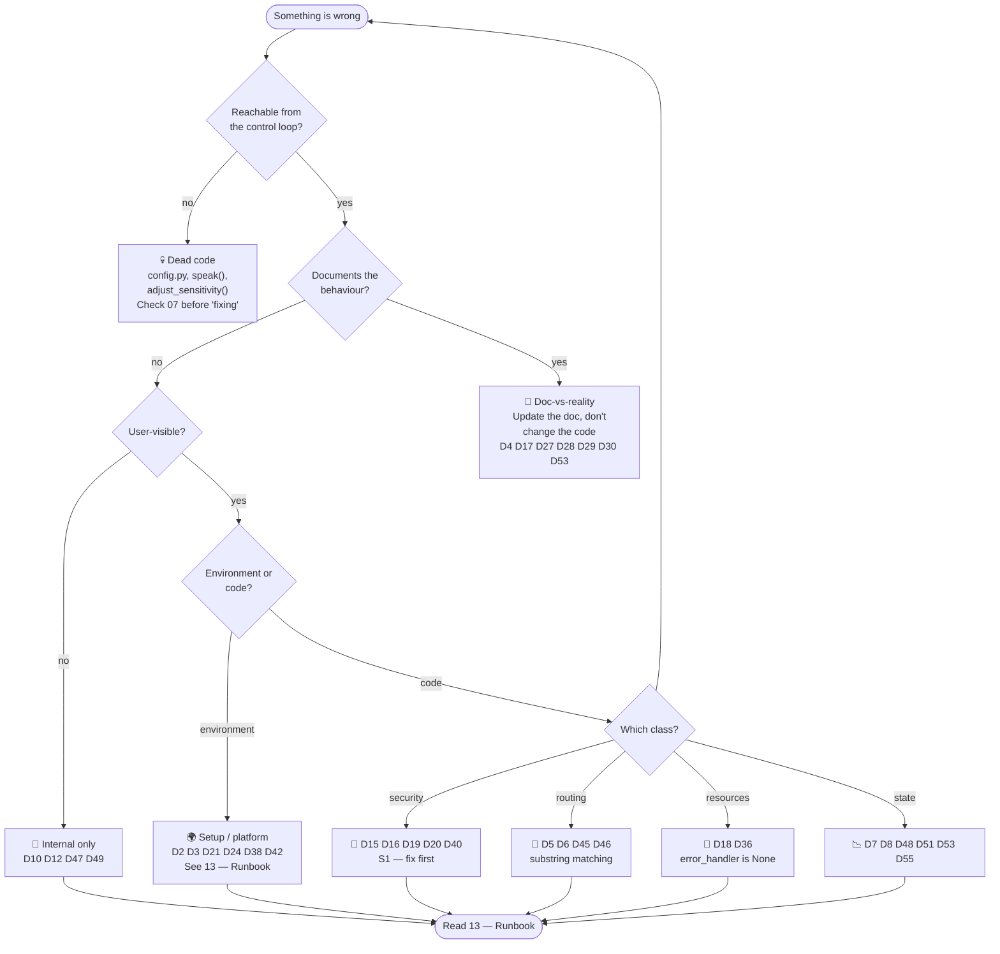

# 12 — Known Caveats & Limitations

Everything that will surprise you, in the order you will meet it. Grouped by **when it happens**,
not by which module owns it. Every entry links to its full analysis in
[07 — Findings & Issues](07_FINDINGS_AND_ISSUES.md).

> **Read this before filing a bug.** A large fraction of "it's broken" reports are one of the
> entries below. Each one is already a tracked GitHub issue with a fix proposal.

---

## 12.0 · Symptom → cause index

| Symptom | Most likely cause | Finding |
|---|---|---|
| `ModuleNotFoundError` from `python -m app.health_check` | `app/__init__.py` imports everything eagerly | [D2](07_FINDINGS_AND_ISSUES.md) |
| Health check says everything is fine when nothing is installed | you never actually got it to run | [D2](07_FINDINGS_AND_ISSUES.md) |
| `setup.sh` dies silently at the end | `cp` of a non-existent `.env.template`, under `set -e` | [D3](07_FINDINGS_AND_ISSUES.md) |
| Spotify rejected my credentials | you edited the wrong `.env` — it's `env/.env` | [D4](07_FINDINGS_AND_ISSUES.md) |
| Says "jarvis, play hotel california" plays a song called **"ing"** | substring routing, `'play' in command` wins first | [D5](07_FINDINGS_AND_ISSUES.md) |
| Says "goodbye" and the music **starts** | bare `'go'` substring | [D6](07_FINDINGS_AND_ISSUES.md) |
| Says "go back" and the music **starts** | same, rule 2 precedes rule 5 | [D6](07_FINDINGS_AND_ISSUES.md) |
| Wake word triggers on unrelated speech | `wake_word in text` substring match | [D6](07_FINDINGS_AND_ISSUES.md) |
| "louder" does nothing | device reported no `volume_percent`; no `else` branch | [D46](07_FINDINGS_AND_ISSUES.md) |
| "what's playing" plays a track named "ing" | same routing bug as D5 | [D45](07_FINDINGS_AND_ISSUES.md) |
| Auth succeeds, then crashes on save | `save_to_cache` is not implemented | [D40](07_FINDINGS_AND_ISSUES.md) |
| Token stored as **plaintext** | `cryptography` missing → silent fallback | [D16](07_FINDINGS_AND_ISSUES.md) |
| Recognition ignores the tuned thresholds | both `listen_*` build a fresh local `Recognizer` | [D7](07_FINDINGS_AND_ISSUES.md) |
| Sensitivity never self-corrects | `attempt_count` is never incremented | [D8](07_FINDINGS_AND_ISSUES.md) |
| Ctrl+C dropped me into a text prompt I didn't expect | SIGINT is the *designed* way to reach text mode | by design |
| No audible feedback, only notifications | `speak()` has zero call sites | [D28](07_FINDINGS_AND_ISSUES.md) |
| `python app/main.py` fails | relative imports require `python -m app.main` | [D38](07_FINDINGS_AND_ISSUES.md) |
| Network check always passes | it reports `ok` whatever happens | [D24](07_FINDINGS_AND_ISSUES.md) |
| macOS setup script missing | the dispatcher calls a file that doesn't exist | [D21](07_FINDINGS_AND_ISSUES.md) |
| `pip install -r requirements.txt` then no sound | `pyatx`/`pyautogui`/`psutil`/`colorama` are declared but unused | [D42](07_FINDINGS_AND_ISSUES.md) |

---

## 12.1 · Installation caveats

| # | Caveat | Detail | Finding |
|---|---|---|---|
| 1.1 | **`setup.sh` cannot complete on a clean clone** | `setup.sh:63` runs `cp env/.env.template env/.env` unconditionally and last; `env/.env.template` does not exist. Under `set -euo pipefail` the script exits at step 5 of 5 — **after** it has created the venv and installed everything. The "Setup complete!" message is never printed. | [D3](07_FINDINGS_AND_ISSUES.md) |
| 1.2 | `universal_setup.sh` behaves *better*, inconsistently | It prompts first and survives `n`; it runs *before* the other installers. So the same machine can fail on one script and succeed on the other. | [D3](07_FINDINGS_AND_ISSUES.md) |
| 1.3 | `setup.sh:73` is not a credential prompt | It only echoes the path. A user who assumes it is a prompt will believe setup is interactive when it is not. | [D3](07_FINDINGS_AND_ISSUES.md) |
| 1.4 | **No macOS automated setup** | `setup:51` dispatches to `setup_macos.sh`, which does not exist. | [D21](07_FINDINGS_AND_ISSUES.md) |
| 1.5 | Declared-but-unused packages | `pyatx`, `pyautogui`, `psutil`, `colorama` are in `requirements.txt` and never imported — 4 unnecessary installs and a larger failure surface. | [D42](07_FINDINGS_AND_ISSUES.md) |
| 1.6 | An **undeclared** package | `cryptography` is imported by the token layer but is not in `requirements.txt`. | [D16](07_FINDINGS_AND_ISSUES.md) |
| 1.7 | `pip install -r requirements.txt` is not the whole story | PortAudio itself is a **system** package (`portaudio19-dev` / `brew portaudio`). Python packages alone will not make audio work. | — |
| 1.8 | The only build-level check that exists | `python3 -m py_compile app/*.py`. There is **no test suite, linter, formatter, or type checker**. | [D33](07_FINDINGS_AND_ISSUES.md) |

---

## 12.2 · Startup caveats

| # | Caveat | Detail | Finding |
|---|---|---|---|
| 2.1 | **Importing the package has side effects** | `assistant.py:11-17` creates `logs/` and opens a `RotatingFileHandler` at module-import time. Anything that imports `app` inherits that — including test runners and linters. | [D9](07_FINDINGS_AND_ISSUES.md) |
| 2.2 | The diagnostic cannot run when it is needed | `app/__init__.py` eagerly imports every module, so `python -m app.health_check` raises `ModuleNotFoundError` — *precisely* the condition it exists to diagnose. | [D2](07_FINDINGS_AND_ISSUES.md) |
| 2.3 | `python -m app` is **not** the assistant | `__main__.py` is the health check. The assistant is `python -m app.main`. | [D38](07_FINDINGS_AND_ISSUES.md) |
| 2.4 | `python app/main.py` fails | The package uses relative imports, so it must be launched with `-m` for `__package__` to resolve. | [D38](07_FINDINGS_AND_ISSUES.md) |
| 2.5 | Must be run from the repo root | `.env` is resolved as `app/../env/.env` relative to the module file, and `cache/`, `logs/`, `calibration/` are created relative to the CWD. | [D4](07_FINDINGS_AND_ISSUES.md) |
| 2.6 | A missing package degrades silently, not loudly | Some imports are wrapped in `try/except ImportError`, so a broken dependency can leave a feature quietly dead instead of raising. | [D42](07_FINDINGS_AND_ISSUES.md) |

---

## 12.3 · Runtime caveats

| # | Caveat | Detail | Finding |
|---|---|---|---|
| 3.1 | **Every turn is a network round-trip** | Recognition is Google's web API. Wake detection is not local, so it cannot be fast or offline. Any "why is it slow / why does it need internet" question has this answer. | [D56](07_FINDINGS_AND_ISSUES.md) |
| 3.2 | Single-threaded by design | No async, no concurrency. A slow API call blocks the whole loop. | by design |
| 3.3 | Unrecognised commands are silently dropped | `process_command` has **no `else` branch**. No error, no notification, nothing. | [D5](07_FINDINGS_AND_ISSUES.md) |
| 3.4 | Volume changes can be a silent no-op | No `volume_percent` on the device → the method returns `None` and notifies nothing. | [D46](07_FINDINGS_AND_ISSUES.md) |
| 3.5 | Nothing is ever spoken aloud | The only output channel is desktop notifications. `speak()` exists and is never called. | [D28](07_FINDINGS_AND_ISSUES.md) |
| 3.6 | Google rate limiting is per-call-site | The 45/min limiter is invoked from `listen_for_command` only, not from wake-word listening. | [D10](07_FINDINGS_AND_ISSUES.md) |
| 3.7 | A second mic device is never selected | Despite the name, `select_best_microphone()` returns one *shared* default instance. It exists to prevent device locking, not to rank devices. | [D55](07_FINDINGS_AND_ISSUES.md) |
| 3.8 | KeyboardInterrupt means "switch mode" | Ctrl+C never quits the process — it flips into text mode. | by design |
| 3.9 | Cleanup is incomplete | `SpotifyController.cleanup()` expects an `error_handler` that is always `None`, so token-cache clearing silently fails. | [D18](07_FINDINGS_AND_ISSUES.md), [D36](07_FINDINGS_AND_ISSUES.md) |

---

## 12.4 · Security caveats

| # | Caveat | Severity | Detail | Finding |
|---|---|---|---|---|
| 4.1 | Token cache is written by a method spotipy never calls | **S1** | The class defines `save_token_to_cache()`, but the spotipy cache protocol requires **`save_to_cache()`**. The handler is wired at `spotify_control.py:145`, so the first token save should raise. | [D40](07_FINDINGS_AND_ISSUES.md) |
| 4.2 | Silent downgrade to plaintext | **S1** | `cryptography` is undeclared; without it the token cache falls back to an unencrypted scheme **without warning**. | [D16](07_FINDINGS_AND_ISSUES.md) |
| 4.3 | `config/` is tracked and would receive a secret | **S1** | `.gitignore` does not cover `config/`, and `ConfigManager.save_config()` writes `client_secret` there. Reachable only because `config.py` is dead code. | [D19](07_FINDINGS_AND_ISSUES.md) |
| 4.4 | Key stored beside its ciphertext | **S3** | `cache/.key` next to `cache/.spotify_tokens.enc` — directory perms are the only barrier. | [D15](07_FINDINGS_AND_ISSUES.md) |
| 4.5 | Path-traversal guard is wrong | **S3** | `startswith(calibration_dir)` passes for `../calibration_evil`. Separately, `lstrip('../')` strips a *character set*, not a prefix. | [D20](07_FINDINGS_AND_ISSUES.md) |
| 4.6 | What is *correct* | — | ✅ `cache/` = `0o700`, `.key` = `0o600`; no `shell=True` anywhere; `env/` is ignored; no user data is interpolated into shell strings. | — |

---

## 12.5 · Cross-platform caveats

| # | Caveat | Detail | Finding |
|---|---|---|---|
| 5.1 | The notification fallback chain **cannot** trigger | The first backend that imports successfully always reports success, so the later 4 are unreachable in practice. | [D9](07_FINDINGS_AND_ISSUES.md) |
| 5.2 | `subprocess.CREATE_NO_WINDOW` is Windows-only | Referenced bare; on Linux/macOS the attribute does not exist. | [D51](07_FINDINGS_AND_ISSUES.md) |
| 5.3 | Notification title/body wording is inconsistent | Titles and body text vary across call sites for the same event (e.g. `🎵 Now Playing (Enhanced)` vs `🎵 Now Playing`). Cosmetic only — **argument order is uniform**, see the retracted D54. | — |
| 5.4 | `osascript` is unvalidated | The macOS path is never executed in CI or by the health check; quoting and availability are assumed. | [D21](07_FINDINGS_AND_ISSUES.md) |
| 5.5 | Windows behaviour is inferred, not executed | No Windows CI. Permission bits, TTS, and `win10toast` are reasoned about statically. | [D33](07_FINDINGS_AND_ISSUES.md) |
| 5.6 | Platform matrix | Windows ✅ (installer) · Linux ✅ (2 installers, native + Flatpak) · macOS ⚠️ (no installer) | [D21](07_FINDINGS_AND_ISSUES.md) |

---

## 12.6 · Diagnostics caveats

| # | Caveat | Detail | Finding |
|---|---|---|---|
| 6.1 | It writes to your filesystem | Creates `cache/`, `logs/`, `calibration/` and a temporary probe file. It is a prober, not a test suite — do not run it as a check in CI. | [D25](07_FINDINGS_AND_ISSUES.md) |
| 6.2 | The network check is a no-op verdict | It reports `ok` regardless of the outcome. | [D24](07_FINDINGS_AND_ISSUES.md) |
| 6.3 | Exit codes are inverted | `0` ok, `1` critical, **`2` warning** — 2 conventionally means "usage error". | [D44](07_FINDINGS_AND_ISSUES.md) |
| 6.4 | It requires a microphone | Hardware must be present and unlocked, even for the checks that do not use it. | [D25](07_FINDINGS_AND_ISSUES.md) |

---

## 12.7 · Documentation-vs-reality caveats

The gap between the README and the code is the largest single source of confusion in this
project. Full table in [11 § F-12](11_FEATURES_AND_CAPABILITIES.md#f-12--features-that-are-documented-but-do-not-exist).

| Claim | Reality | Finding |
|---|---|---|
| Automatic fallback to text mode | only SIGINT sets the flag | [D27](07_FINDINGS_AND_ISSUES.md) |
| Spoken / TTS responses | `speak()` has zero call sites | [D28](07_FINDINGS_AND_ISSUES.md) |
| "I'll automatically adjust sensitivity" — printed by `help` | `adjust_sensitivity()` is a permanent no-op | [D29](07_FINDINGS_AND_ISSUES.md) |
| `config/config.json` holds settings | zero inbound imports | [D17](07_FINDINGS_AND_ISSUES.md) |
| "7-day calibration validity" | persists indefinitely, no expiry | [D53](07_FINDINGS_AND_ISSUES.md) |
| Token cache at `cache/tokens.json` | actually `cache/.spotify_tokens.enc` | [D30](07_FINDINGS_AND_ISSUES.md) |
| `.env` in the repo root | actually `env/.env` | [D4](07_FINDINGS_AND_ISSUES.md) |
| Wake detection ≈ 100 ms | unmeasured; a full STT round-trip | [D56](07_FINDINGS_AND_ISSUES.md) |

---

## 12.8 · Triage flow

---

## 12.9 · Things that are *not* caveats

Stated explicitly, because each has been misdiagnosed as a bug before.

| Behaviour | Why it is correct |
|---|---|
| Ctrl+C opens a text prompt | The designed escape hatch — there is no other reliable way to type a command. |
| No `else` on unknown commands | Arguably a defect ([D5](07_FINDINGS_AND_ISSUES.md)), but the *lack of feedback* is at least a deliberate, consistent choice. |
| Notifications only, no TTS | No audio output library is wired in; adding one is a scope change, not a fix. |
| Single-threaded blocking loop | Network-bound by nature; threads would add failure modes for no latency win. |
| `env/` absent until you create it | Intentionally never committed. |
| No `macos` entry in CI | The project has no CI at all — this is not a platform-specific regression. |

---

## Related

[00 — Project Overview](00_PROJECT_OVERVIEW.md) ·
[05 — Configuration & Environment](05_CONFIGURATION_AND_ENV.md) ·
[11 — Features & Capabilities](11_FEATURES_AND_CAPABILITIES.md) ·
[13 — Runbook](13_RUNBOOK.md) ·
[07 — Findings & Issues](07_FINDINGS_AND_ISSUES.md)