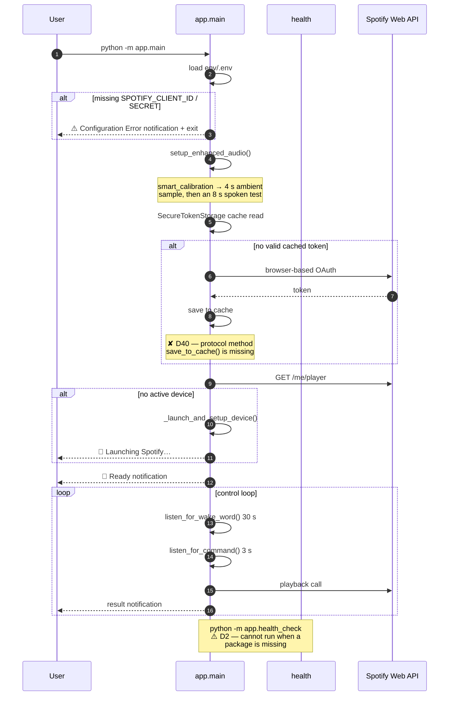
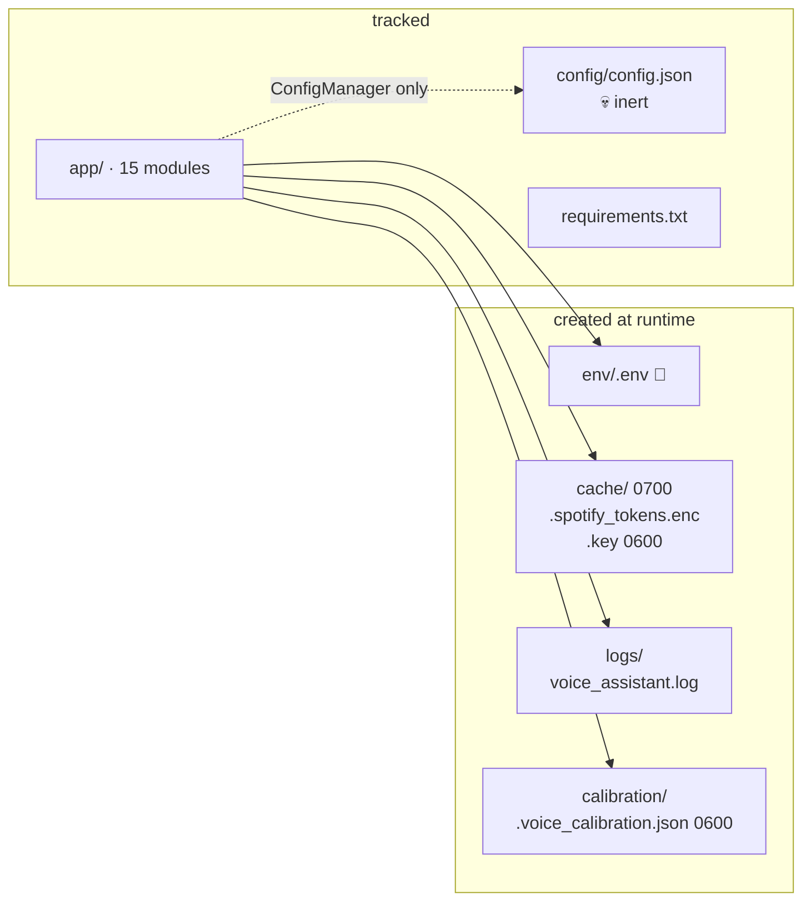

# 13 — Runbook

Operational procedures: install, run, recover, and uninstall. Written for someone starting from a
clean clone with **no prior context on this project**.

> ⚠️ **Use the manual install below, not `setup.sh`.** On a clean clone `setup.sh` aborts at step 5
> of 5 under `set -euo pipefail` because it copies a non-existent `env/.env.template`. Everything it
> did before that point still happened, so a half-finished install is the normal result.
> Root cause: [D3](07_FINDINGS_AND_ISSUES.md).

---

## 13.1 · Prerequisites

| Requirement | Version | How to check |
|---|---|---|
| Python | 3.7+ (3.10+ recommended) | `python3 --version` |
| PortAudio | 19+ | `python3 -c "import pyaudio"` after install |
| A microphone | any USB/built-in | OS sound settings |
| Desktop notifications | a running notification daemon (Linux) / toast service (Windows) | — |
| Spotify Premium | **required** | Web API playback control needs it |
| Network | outbound HTTPS to Google **and** Spotify | — |
| `cryptography` | any | **not** in `requirements.txt` — install it explicitly ([D16](07_FINDINGS_AND_ISSUES.md)) |

### System packages

```bash
# Debian / Ubuntu
sudo apt install portaudio19-dev python3-dev python3-venv

# Fedora
sudo dnf install portaudio-devel python3-devel

# Arch
sudo pacman -S portaudio python

# macOS
brew install portaudio
```

---

## 13.2 · Install (the reliable path)

```bash
git clone <repo-url>
cd spotify-voice-assistant

# 1. virtualenv
python3 -m venv venv
source venv/bin/activate          # Windows: venv\Scripts\activate

# 2. dependencies
pip install --upgrade pip
pip install -r requirements.txt

# 3. the undeclared one — without it the token cache falls back to plaintext
pip install cryptography

# 4. credentials — create the file yourself; there is no template to copy
mkdir -p env
cat > env/.env <<'EOF'
SPOTIFY_CLIENT_ID=your_client_id
SPOTIFY_CLIENT_SECRET=your_client_secret
SPOTIFY_REDIRECT_URI=http://127.0.0.1:8080/callback
WAKE_WORD=jarvis
EOF

chmod 600 env/.env
```

`env/` is git-ignored. **`env/.env` is the only place these values are read from** —
`app/utils.py:5` resolves `app/../env/.env`. Editing a `.env` in the repo root does nothing.
→ [D4](07_FINDINGS_AND_ISSUES.md)

### Windows

`setup_windows.bat` / `setup_windows.ps1` generate `env/.env` inline and do **not** have the
`setup.sh` bug — they are the reference for how `.env` creation should work. Windows may also need
the Visual C++ Build Tools for PyAudio.

---

## 13.3 · Spotify application setup

1. Open the [Spotify Developer Dashboard](https://developer.spotify.com/dashboard/).
2. **Create app** → name it anything.
3. **Add redirect URI** — it must match `SPOTIFY_REDIRECT_URI` *exactly*, including scheme, port
   and trailing path:

   ```text
   http://127.0.0.1:8080/callback
   ```

4. Open **Settings** → copy the **Client ID** and **Client Secret**.
5. Paste both into `env/.env`.

### Scopes requested

```python
# app/spotify_control.py:129
scope = "user-modify-playback-state,user-read-playback-state,user-read-currently-playing"
```

Three scopes, all playback-related. No email, no playlist-write, no library-read. The
`user-read-email` scope is **not** requested and is not needed.

---

## 13.4 · Run

Both commands are launched from the **repository root**.

| Command | What it does |
|---|---|
| `python -m app.main` | **The assistant.** Voice loop with wake word. |
| `python -m app.health_check` | Environment diagnostic — not the assistant. |
| `python app/main.py` | ❌ Fails. Relative imports require `-m`. → [D38](07_FINDINGS_AND_ISSUES.md) |
| `python -m app` | ⚠️ Also the health check (`__main__.py`), **not** the assistant. |

### First run sequence



---

## 13.5 · Command cheat sheet

### Voice — say the wake word first

`jarvis` → then one of:

| Intent | Say | Result |
|---|---|---|
| Search + play | "play hotel california" | ✅ plays the top match |
| Search by artist | "play bohemian rhapsody by queen" | ✅ |
| Resume | "resume" · "start music" | ✅ |
| Pause | "pause" · "stop" · "halt" | ✅ |
| Next | "next" · "skip this" · "forward" | ✅ |
| Previous | "previous" · "last track" | ⚠️ avoid "go back" → [D6](07_FINDINGS_AND_ISSUES.md) |
| Volume | "volume up" / "louder" / "volume down" / "quieter" | ⚠️ silent no-op if the device reports no volume → [D46](07_FINDINGS_AND_ISSUES.md) |
| Now playing | "now" · "what is this" | ⚠️ "what's playing" is broken → [D45](07_FINDINGS_AND_ISSUES.md) |
| Quit | "quit" · "exit" · "bye" | ⚠️ **not** "goodbye" → [D6](07_FINDINGS_AND_ISSUES.md) |

**Avoid `what's playing`, `now playing`, `goodbye`, `go back`.** All four hit a substring bug.

### Text — press Ctrl+C once

| Input | Action |
|---|---|
| `<any command>` | same router as voice |
| `help` | recognition tips |
| `voice` | return to the wake-word loop |
| `wake` | change the wake word (persisted) |
| `recalibrate` | force audio recalibration |
| `quit` · `exit` · `q` | **the only reliable way to shut down** |

Ctrl+C returns to voice mode; it does not kill the process.

---

## 13.6 · Filesystem layout

Created on first run, all git-ignored.

| Path | Permission | Contents |
|---|---|---|
| `env/.env` | `0o600` | client id/secret, redirect URI, wake word |
| `cache/` | `0o700` | `.spotify_tokens.enc` (token), `.key` (Fernet key) |
| `logs/` | — | `voice_assistant.log`, rotating |
| `calibration/.voice_calibration.json` | auto-repaired to `0o600` | energy/pause thresholds, `success_rate`, `wake_word`, `last_calibrated` |
| `config/config.json` | **tracked** | inert — [D17](07_FINDINGS_AND_ISSUES.md), [D19](07_FINDINGS_AND_ISSUES.md) |



---

## 13.7 · Troubleshooting by symptom

Each row links to the full finding.

| Symptom | Action |
|---|---|
| `ModuleNotFoundError: spotipy` from the health check | Expected — [D2](07_FINDINGS_AND_ISSUES.md). Verify by hand: `python3 -c "import spotipy, speech_recognition, pyaudio, pyttsx3, dotenv"`. |
| Setup script exited silently | `setup.sh:63` — create `env/.env` manually ([13.2](#132--install-the-reliable-path)). |
| "Invalid client" / auth rejected | Wrong `.env` location, or redirect URI does not match exactly ([D4](07_FINDINGS_AND_ISSUES.md)). |
| Crash right after OAuth (`AttributeError: save_to_cache`) | [D40](07_FINDINGS_AND_ISSUES.md): the cache handler defines the wrong method name. There is **no config-level workaround** — the app reads only `SPOTIFY_CLIENT_ID` / `SPOTIFY_CLIENT_SECRET` / `SPOTIFY_REDIRECT_URI` (`assistant.py:39-41`), never a token env var. Requires the one-line rename in `spotify_control.py:78`. |
| Token file is plain text | `cryptography` missing → `pip install cryptography` ([D16](07_FINDINGS_AND_ISSUES.md)). |
| No sound, no notifications | No notification daemon on Linux; the `print()` fallback is silent ([D9](07_FINDINGS_AND_ISSUES.md)). |
| PyAudio won't build | Install PortAudio **and** `python3-dev` first ([13.1](#131--prerequisites)). |
| Recognition keeps missing | Ctrl+C → type `recalibrate`, then speak during the prompt. Note `audio.py:221` uses a **short sample transcript** (<3 words) to lower `energy_threshold`; it is a calibration heuristic, not a phrase-length rule. |
| Wake word triggers constantly | Short wake words match as substrings. Use `wake` to pick something distinctive. |
| "Could not find '…'" | No matching track, or the search is rate-limited. |
| Music will not start | No active device — the app auto-launches; if it does not appear, open Spotify manually first. |
| Everything is too slow | Each turn is a Google STT round-trip. Not a bug. |

---

## 13.8 · Recovery & reset

```bash
# Full re-authentication (delete the cached token)
rm -f cache/.spotify_tokens.enc

# Regenerate the encryption key — destroys any existing token
rm -f cache/.key

# Reset audio calibration
rm -f calibration/.voice_calibration.json

# Re-run diagnostics
python -m app.health_check

# Read the log
tail -f logs/voice_assistant.log
```

To start genuinely fresh:

```bash
rm -rf cache/ calibration/ logs/
```

None of these lose real user data — the only irreversible state is the Spotify OAuth token, which
can always be re-acquired.

---

## 13.9 · Uninstall

```bash
deactivate 2>/dev/null || true
rm -rf venv/ cache/ calibration/ logs/ __pycache__/ app/__pycache__/
# env/.env holds your credentials — delete it deliberately
# rm -f env/.env
```

Installed system packages (PortAudio, build tools) are left in place.

---

## 13.10 · Security hardening

The defaults are already sound in three places; the rest is worth knowing.

| Item | Status |
|---|---|
| `chmod 600 env/.env` | do this — nothing enforces it |
| `pip install cryptography` | **required**, not optional |
| Add `cache/`, `logs/`, `calibration/` to `.gitignore` | verify — only `env/` is guaranteed ignored |
| Never commit `env/.env` | enforced by `.gitignore` |
| Treat `config/config.json` as sensitive | it is **tracked**, and `save_config()` would write a secret into it ([D19](07_FINDINGS_AND_ISSUES.md)) |
| Review `cache/.key` exposure | it sits beside its ciphertext ([D15](07_FINDINGS_AND_ISSUES.md)) |

---

## 13.11 · What still does not work

The full list is in [12 — Caveats](12_KNOWN_CAVEATS_AND_LIMITATIONS.md) and
[11 — Features](11_FEATURES_AND_CAPABILITIES.md). The four that most often surprise people:

1. **`what's playing` and `goodbye` are misrouted** — [D5](07_FINDINGS_AND_ISSUES.md), [D6](07_FINDINGS_AND_ISSUES.md)
2. **There is no audible response** — notifications only — [D28](07_FINDINGS_AND_ISSUES.md)
3. **Sensitivity never adapts** — [D8](07_FINDINGS_AND_ISSUES.md)
4. **Volume can silently do nothing** — [D46](07_FINDINGS_AND_ISSUES.md)

---

## Related

[05 — Configuration & Environment](05_CONFIGURATION_AND_ENV.md) ·
[11 — Features & Capabilities](11_FEATURES_AND_CAPABILITIES.md) ·
[12 — Caveats & Limitations](12_KNOWN_CAVEATS_AND_LIMITATIONS.md) ·
[07 — Findings & Issues](07_FINDINGS_AND_ISSUES.md) ·
[14 — Architecture Diagrams](14_ARCHITECTURE_DIAGRAMS.md)