# 14 — Architecture Diagrams

A visual index of the whole system. Every diagram here is derived from the source at commit
`69a9724` and cross-references the prose docs. **Nothing in this file is aspirational** — if a
box exists, there is code for it; if an edge is dashed, the edge does not exist at runtime.

Companion prose: [02 — Architecture](02_ARCHITECTURE.md) (style & patterns),
[04 — Data Flows](04_DATA_FLOWS.md) (step-by-step traces),
[03 — Module Reference](03_MODULE_REFERENCE.md) (per-function detail).

---

## D-1 · System context — what the process touches

The assistant is a single foreground process. It talks to exactly three things outside itself:
the Spotify Web API, Google's speech endpoint, and the local operating system.

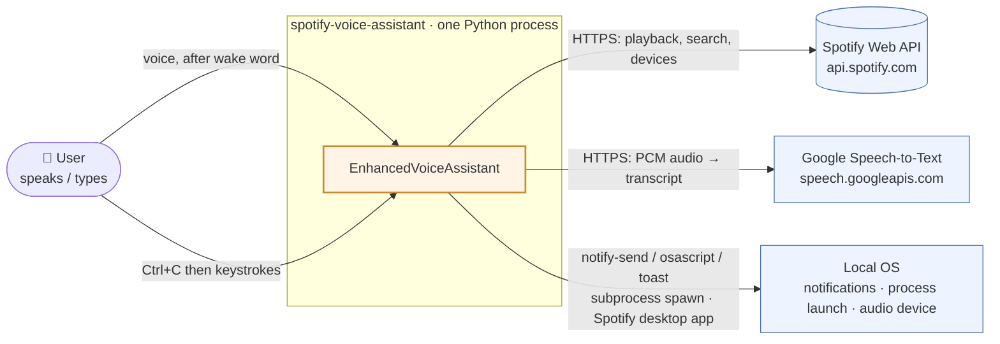

**Caveats that shape this picture**

| Fact | Consequence | Finding |
|---|---|---|
| Audio leaves the machine for Google | No offline mode; Google quota + internet are hard requirements | — |
| Audio is recognised with a **30 s timeout per wake poll** | Each idle cycle costs one blocking network round-trip | — |
| Spotify OAuth happens during `__init__` | First run can block on a browser before the loop starts | [D40](07_FINDINGS_AND_ISSUES.md) |
| Notifications are the *only* user-facing output | With no notification backend, everything degrades to `print()` | [D9](07_FINDINGS_AND_ISSUES.md) |
| `config/` is not part of the runtime | Shown greyed in [D-3](#d-3--container--what-is-actually-loaded-at-runtime) | [D17](07_FINDINGS_AND_ISSUES.md) |

---

## D-2 · Component graph — all 15 modules

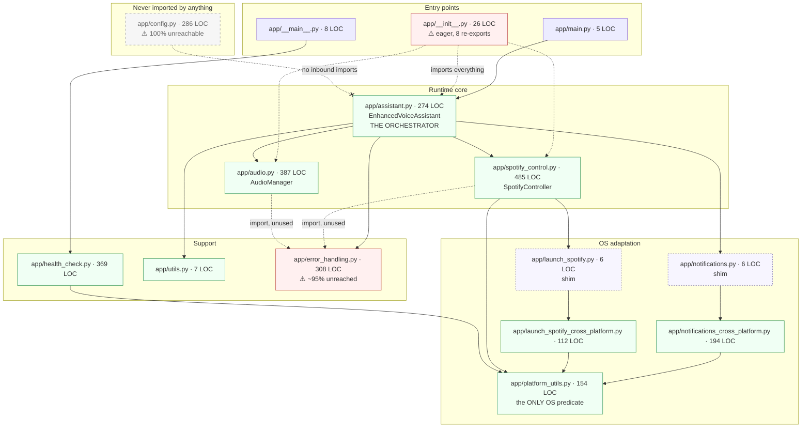

**Dependency rule that holds everywhere:** `assistant` → {audio, spotify_control, notifications,
utils}. Everything else flows downward. `platform_utils.py` depends on the standard library
only. **No import cycles exist** (verified by AST walk — see [02](02_ARCHITECTURE.md)).

Two red flags are structural, not cosmetic:

- **`app/__init__.py` is the reason `health_check` cannot run.** Any `python -m app.*` executes
  the package body, which imports `spotipy`, `speech_recognition` and `pyttsx3`. So the
  missing-dependency diagnostic *requires* the dependencies. → [D2](07_FINDINGS_AND_ISSUES.md)
- **`config.py` has zero inbound imports.** `config/config.json` is never read at runtime.
  → [D17](07_FINDINGS_AND_ISSUES.md)

---

## D-3 · Container — what is actually loaded at runtime

Trace of a real `python -m app.main`. Dashed = declared/imported but never exercised.

```mermaid
flowchart LR
    subgraph IMPORT["Module import time — before any object exists"]
        I1["assistant.py:11-17<br/>os.makedirs('../logs')"]
        I2["RotatingFileHandler<br/>1 MiB × 5"]
        I3["logging.basicConfig(INFO)"]
    end

    subgraph INIT["EnhancedVoiceAssistant.__init__ — assistant.py:21-90"]
        C1["load_environment()<br/>load_dotenv('&lt;repo&gt;/env/.env')"]
        C2["NotificationManager()"]
        C3["ErrorHandler(logger, notifier)"]
        C4["_validate_environment()<br/>raises EnvironmentError if no creds"]
        C5["AudioManager(calibration_file, notifier, wake_word)"]
        C6["SpotifyController(id, secret, uri, cache_path, notifier)"]
    end

    subgraph RUN["run() — assistant.py:92-149"]
        R1["setup_enhanced_audio()<br/>tunes 8 recognizer attrs"]
        R2["signal handlers<br/>SIGTERM→stop · SIGINT→text mode"]
        R3["THE CONTROL LOOP"]
        R4["_cleanup_resources()"]
    end

    subgraph GONE["Declared but never reached"]
        X1["config.ConfigManager<br/>never constructed"]
        X2["error_handling.error_handler<br/>decorator: 0 uses"]
        X3["AudioManager.speak()<br/>0 call sites"]
        X4["adjust_sensitivity()<br/>no-op"]
        X5["switch_to_text_mode<br/>only SIGINT sets it"]
    end

    I1 --> I2 --> I3 --> C1 --> C2 --> C3 --> C4 --> C5 --> C6 --> R1 --> R2 --> R3 --> R4

    classDef bad fill:#fff0f0,stroke:#c04a4a,stroke-dasharray:4 3,color:#8a3030
    class X1,X2,X3,X4,X5 bad
```

> **Note on ordering.** `is_running`, `is_awake`, `switch_to_text_mode` and `_lock` are
> initialised at `assistant.py:82-88` — *inside* `_validate_environment()`, after its early
> return. They therefore only exist on the success path. Code-organisation defect, not a
> functional one.

---

## D-4 · The control loop

This is the only loop in the program. It is single-threaded, blocking, and network-bound.

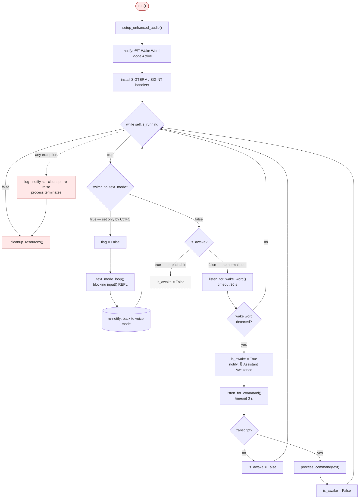

Three structural facts worth internalising:

1. **`is_awake` is always cleared before the next iteration.** The `else` branch at
   `assistant.py:141-142` is therefore dead code. → [D52](07_FINDINGS_AND_ISSUES.md)
2. **Ctrl+C does not quit.** `SIGINT` sets `switch_to_text_mode`; quitting requires typing
   `quit`/`exit`/`q`, or speaking a quit phrase.
3. **A fatal error terminates the process.** `run()` re-raises after cleanup. There is no
   supervisor, no retry-with-backoff, no circuit breaker.

---

## D-5 · Voice cycle — wake word to Spotify call

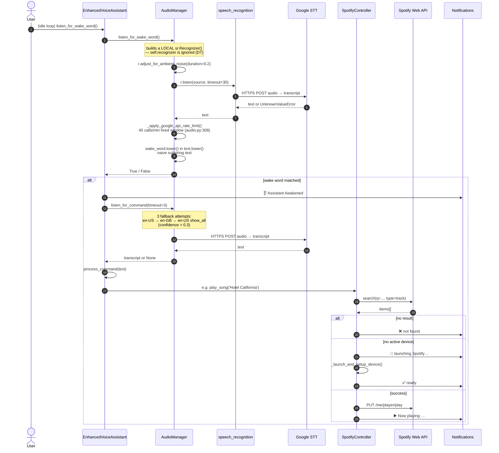

> **The rate limiter is correct but nearly unused.** `_apply_google_api_rate_limit()`
> (`audio.py:308`) enforces 45 calls/min, yet only *one* of its two call sites invokes it.
> → [D47](07_FINDINGS_AND_ISSUES.md)

---

## D-6 · Command dispatch — the exact 9-rule chain

`process_command` (`assistant.py:238-274`) is a flat substring chain with no tokenizer and no
normalisation beyond `.lower().strip()`. **The first matching rule wins.** This is the single
largest source of user-visible bugs.

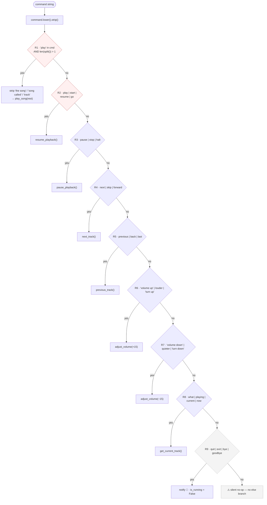

### Two reproducible routing bugs

| Input | Rule that fires | Actual result | Correct intent | Finding |
|---|---|---|---|---|
| `"what's playing"` | **R1** — contains `"play"` | searches Spotify for a track literally named **`"ing"`** and plays it | R8 `get_current_track()` | [D5](07_FINDINGS_AND_ISSUES.md), [D45](07_FINDINGS_AND_ISSUES.md) |
| `"goodbye"` | **R2** — contains substring `"go"` | **resumes playback** instead of quitting | R9 quit | [D6](07_FINDINGS_AND_ISSUES.md) |

> `"go back to previous track"` is a third casualty of R2's bare `"go"`. R2 is checked *before*
> R5, so "previous track" intent never reaches the previous-track rule.
>
> Note `"what's playing"` reaches R8 only for phrasings that avoid the letters `p-l-a-y` —
> `"what is this"`, `"now"`, `"what song"`, `"current song"` all work correctly (verified by
> execution).

---

## D-7 · Application state machine

Three booleans, all on `EnhancedVoiceAssistant`. There is no enum, no dataclass, and no
validation of transitions.

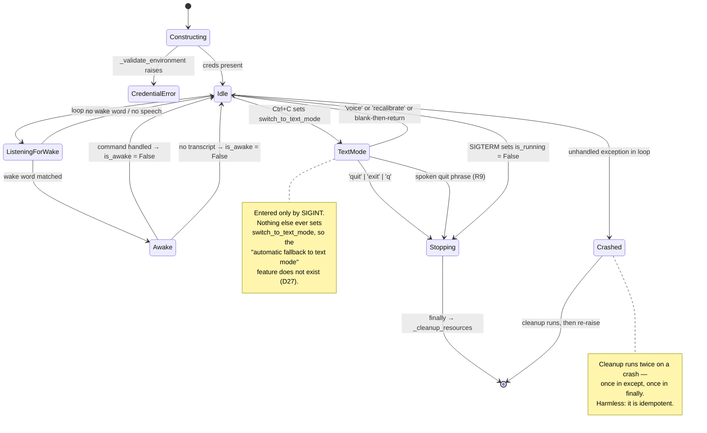

**Invalid-but-reachable states** are not guarded against. `is_awake = True` and
`is_running = False` can be simultaneously true; `process_command` is callable from anywhere and
mutates `is_running` directly (`assistant.py:272`).

---

## D-8 · Filesystem — the only shared state

There is no database, no cache service, no queue. Four git-ignored runtime directories hold
100% of the mutable state. `config/` is tracked but **never read** (see [D17](07_FINDINGS_AND_ISSUES.md)).

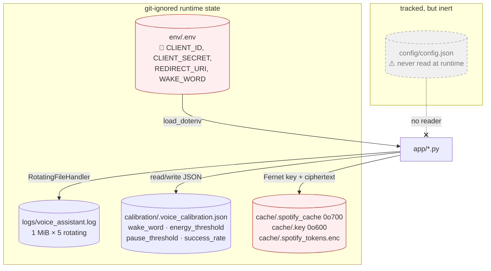

| Path | Written by | Tracked? | Permission note |
|---|---|---|---|
| `env/.env` | human | no | must be `0o600` |
| `logs/voice_assistant.log` | import-time handler | no | — |
| `calibration/.voice_calibration.json` | `change_wake_word`, `save_calibration_data` | no | — |
| `cache/.spotify_tokens.enc` | spotipy via `SecureTokenStorage` | no | `0o600`, key in `cache/.key` |
| `config/config.json` | `ConfigManager.save_config()` | **yes** ⚠️ | would write `client_secret` into a tracked file → [D19](07_FINDINGS_AND_ISSUES.md) |

> `env/.env` is at `env/.env`, **not** the repo root. `README.md` and `QUICKSTART.md` both say
> the root. → [D4](07_FINDINGS_AND_ISSUES.md)

---

## D-9 · Notification fan-out

Notifications are the entire user-facing output channel. There is no GUI and no stdout logging
of user-facing state (except the deliberate fallback).

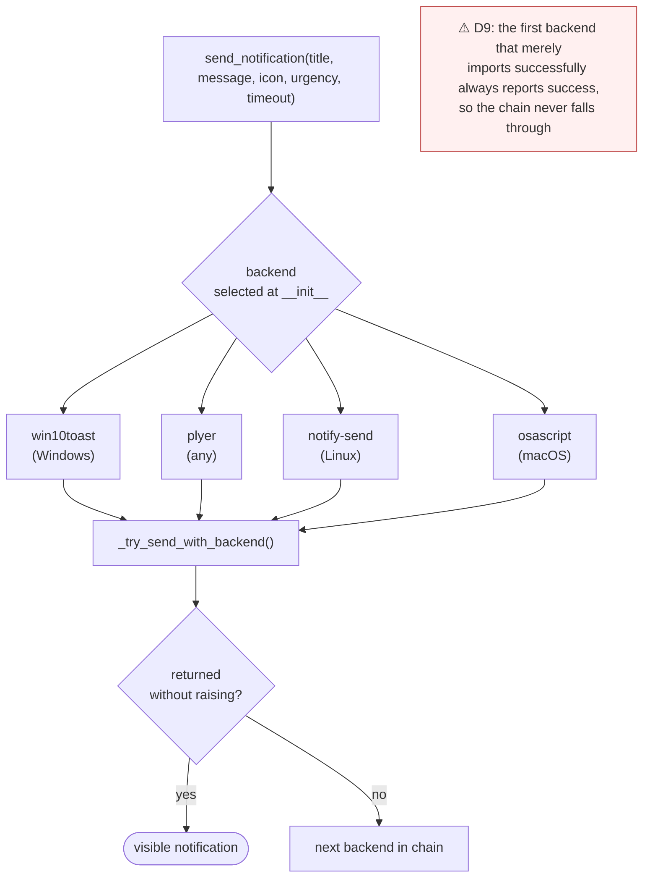

Platform predicates come from `platform_utils.py` (`is_windows()`, `is_linux()`, `is_mac()`) —
the single place OS branching is centralised. → [D9](07_FINDINGS_AND_ISSUES.md),
(D54 retracted — see [07 §Explicit retractions](07_FINDINGS_AND_ISSUES.md))

---

## D-10 · `play_song` — the most complex single path

The only method with a three-way fallback (search → device check → launch) and the one most
worth reading end-to-end. Source: `spotify_control.py:173-229`.

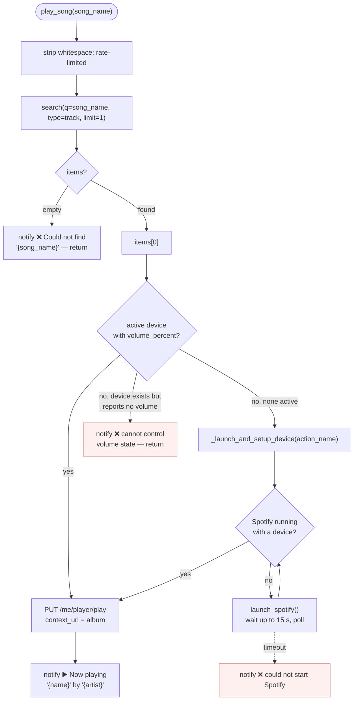

`adjust_volume` (`spotify_control.py:349`) has **no `else` branch** — when
`current['device']['volume_percent']` is `None` the method silently returns without notifying.
→ [D46](07_FINDINGS_AND_ISSUES.md)

---

## D-11 · Token persistence — a broken contract

The clearest example in the codebase of a *contract* mismatch: the implementation is fine, the
name is wrong.

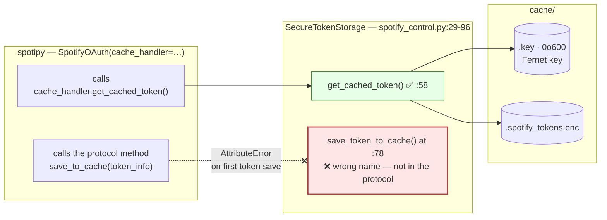

Sequence: OAuth succeeds → spotipy calls `save_to_cache` → `AttributeError` → **the app can fail
after a successful login and never cache a token**. This supersedes the plaintext-fallback
concern ([D16](07_FINDINGS_AND_ISSUES.md)) for the user-facing path, because nothing is ever
written. → [D40](07_FINDINGS_AND_ISSUES.md)

Secondary: `_setup_encryption` catches `ImportError` when `cryptography` is absent (it is
undeclared in `requirements.txt`) and falls back to plaintext storage with only a log warning.
→ [D15](07_FINDINGS_AND_ISSUES.md), [D16](07_FINDINGS_AND_ISSUES.md)

---

## D-12 · Startup failure modes

What actually happens, and what the user sees. Reproduced in a dependency-free environment.

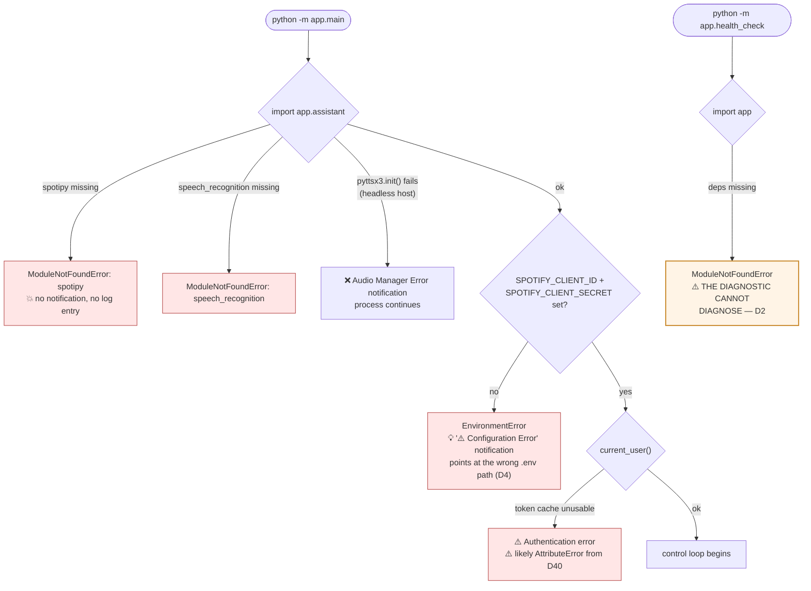

---

## D-13 · Reachability — the honest picture

Roughly 40% of the codebase is unreachable from the running application. This is worth seeing
as a diagram before changing anything.

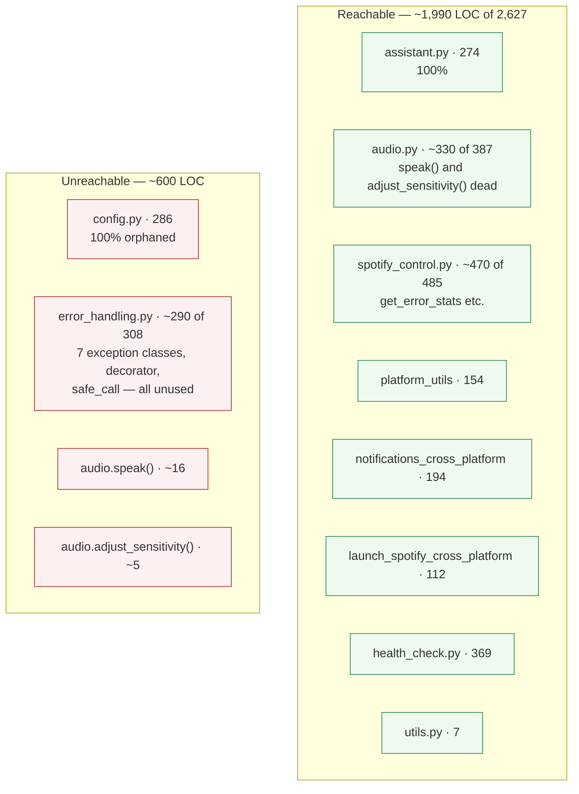

---

## D-14 · Platform support matrix

| Capability | Linux | Windows | macOS |
|---|---|---|---|
| Automated setup script | ⚠️ **fails** — copies a nonexistent template ([D3](07_FINDINGS_AND_ISSUES.md)) | ✅ generates `env\.env` inline | ❌ `setup_macos.sh` **does not exist**; `./setup` calls it anyway ([D21](07_FINDINGS_AND_ISSUES.md)) |
| Assistant runs | ✅ primary target | ✅ ported | ⚠️ works, undocumented path |
| Notifications | `notify-send` | `win10toast` → `plyer` | `osascript` |
| Spotify desktop auto-launch | native + Flatpak | executable path lookup | app path |
| `subprocess.CREATE_NO_WINDOW` | n/a | ✅ attribute exists | n/a — but referenced bare, so it is the *only* thing keeping macOS from crashing the notifier ([D51](07_FINDINGS_AND_ISSUES.md)) |

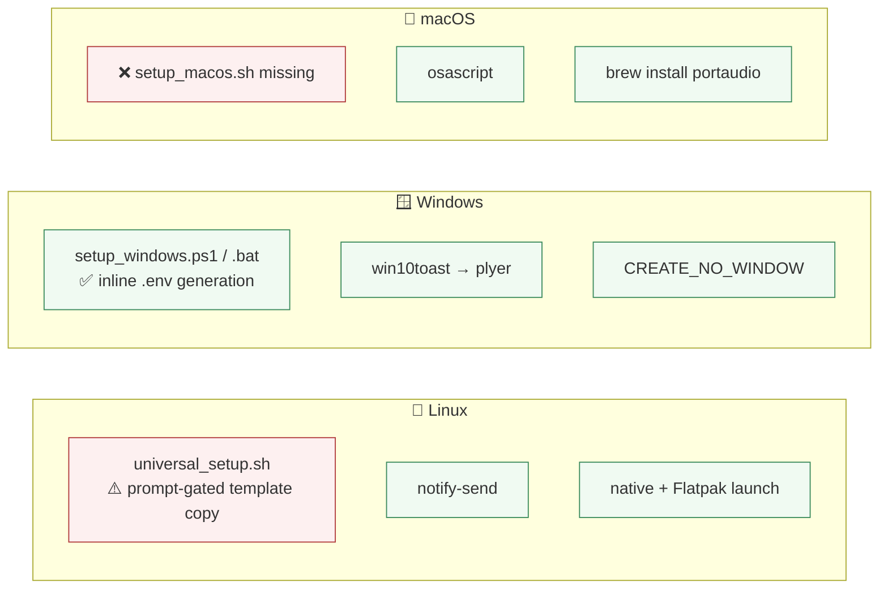

---

## Diagram index

| ID | Diagram | Best for |
|---|---|---|
| [D-1](#d-1--system-context--what-the-process-touches) | System context | "what does this thing talk to?" |
| [D-2](#d-2--component-graph--all-15-modules) | Component graph | "where does this symbol live?" |
| [D-3](#d-3--container--what-is-actually-loaded-at-runtime) | Container / load order | "why does importing break things?" |
| [D-4](#d-4--the-control-loop) | The control loop | "what happens in one idle cycle?" |
| [D-5](#d-5--voice-cycle--wake-word-to-spotify-call) | Voice sequence | "trace one spoken command" |
| [D-6](#d-6--command-dispatch--the-exact-9-rule-chain) | Dispatch chain | "why did my command do that?" |
| [D-7](#d-7--application-state-machine) | State machine | "what state is it in?" |
| [D-8](#d-8--filesystem--the-only-shared-state) | Filesystem | "where is state/secrets?" |
| [D-9](#d-9--notification-fan-out) | Notification chain | "why did I not see a notification?" |
| [D-10](#d-10--play_song--the-most-complex-single-path) | `play_song` flow | "why did playback fail?" |
| [D-11](#d-11--token-persistence--a-broken-contract) | Token contract | "why is login broken?" |
| [D-12](#d-12--startup-failure-modes) | Failure modes | "what just crashed?" |
| [D-13](#d-13--reachability--the-honest-picture) | Reachability | "is this code even used?" |
| [D-14](#d-14--platform-support-matrix) | Platform matrix | "does this work on my OS?" |

---

**Related:** [02 — Architecture](02_ARCHITECTURE.md) ·
[03 — Module Reference](03_MODULE_REFERENCE.md) ·
[04 — Data Flows](04_DATA_FLOWS.md) ·
[11 — Features & Capabilities](11_FEATURES_AND_CAPABILITIES.md) ·
[12 — Caveats & Limitations](12_KNOWN_CAVEATS_AND_LIMITATIONS.md) ·
[13 — Runbook](13_RUNBOOK.md) ·
[07 — Findings & Issues](07_FINDINGS_AND_ISSUES.md)
